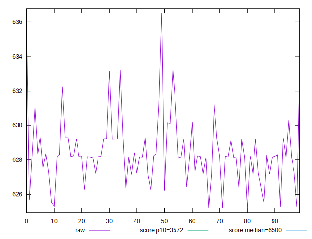
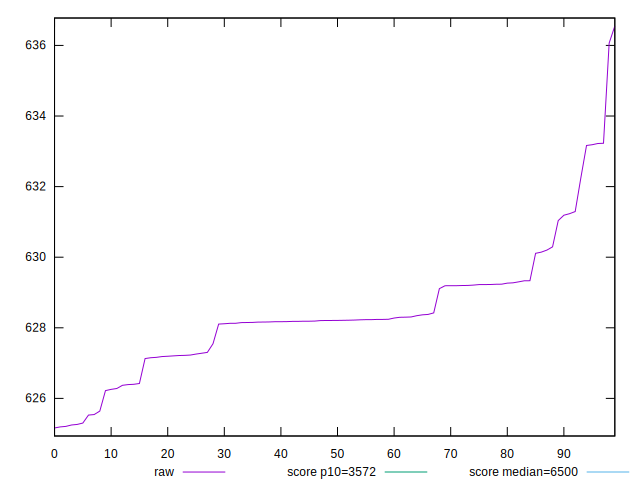
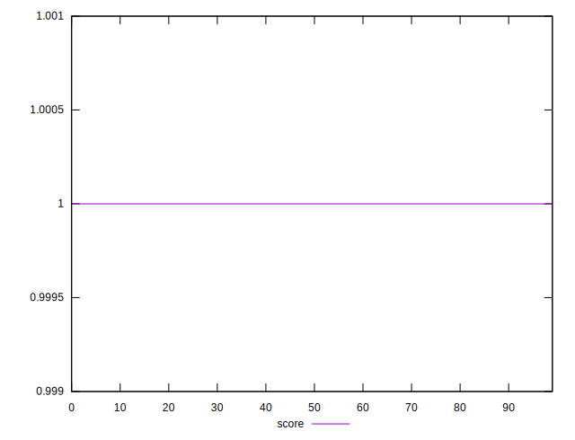

# //first-cpu-idle/samples/empty

[→ Parent](../..)


## Raw


```yaml
p90min: 625.16225
p90max: 631.038
p90range: 5.875750000000039
p90mean: 627.9517794444444
p90median: 628.1864
p90stdev: 1.2782676530691932
p90skewness: -0.45609745153662473
p90eccentricity: 1.0000000000000002
p90discretization: 1
outlandishness: 1.0016525878779043

```


## Score


```yaml
p90min: 0.9999996711806824
p90max: 0.999999725524612
p90range: 5.434392957859302e-8
p90mean: 0.9999997126983923
p90median: 0.9999997157634226
p90stdev: 9.794176075501357e-9
p90skewness: -2.0442278509035456
p90eccentricity: 1.0000000000000009
p90discretization: 1
outlandishness: 1.000000003363915

```

