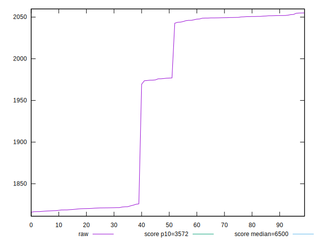
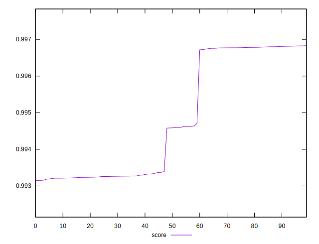
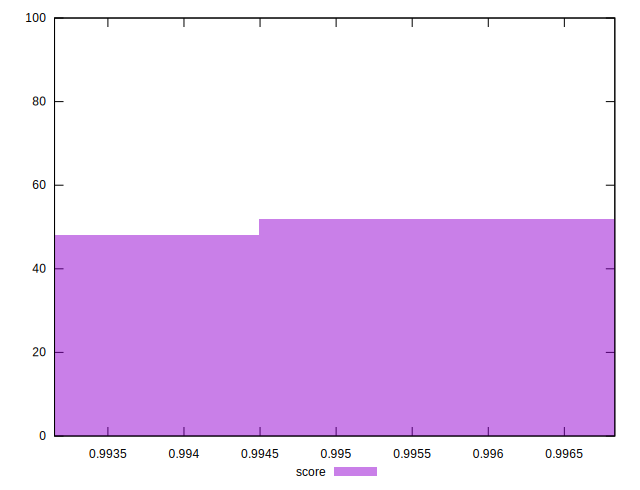

# //first-cpu-idle/samples/pages+cached+noadtech

[→ Parent](../..)


## Raw


```yaml
p90min: 1817.7876000000003
p90max: 2055.00835
p90range: 237.22074999999973
p90mean: 1961.9513296703299
p90median: 2043.9419500000004
p90stdev: 104.29561249191438
p90skewness: -0.5266544508091479
p90eccentricity: 1.0000000000000002
p90discretization: 1
outlandishness: 0.986737393108723

```


## Score


```yaml
p90min: 0.9931492519276602
p90max: 0.9968097766593298
p90range: 0.0036605247316695566
p90mean: 0.9946316771768982
p90median: 0.9933671236041064
p90stdev: 0.0016030025622695227
p90skewness: 0.47574605466443637
p90eccentricity: 1.0000000000000002
p90discretization: 1
outlandishness: 1.0003960187530718

```

