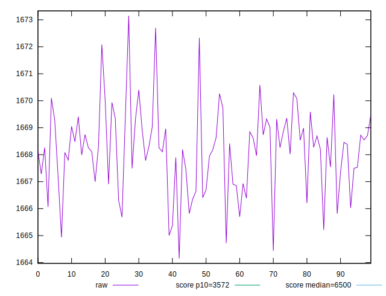
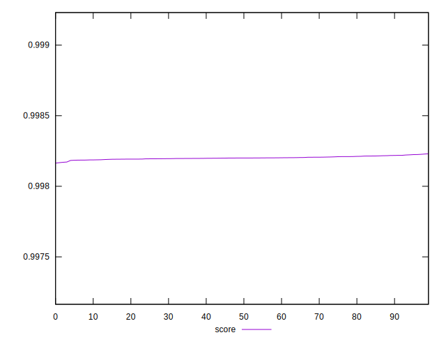
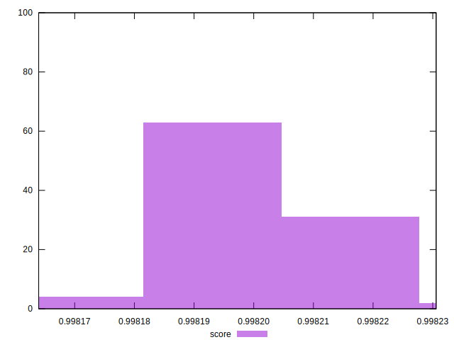

# //first-cpu-idle/samples/pages+cached+noexternal+nocss

[→ Parent](../..)


## Raw


```yaml
p90min: 1664.1504999999997
p90max: 1670.0817999999997
p90range: 5.931299999999965
p90mean: 1667.819527777778
p90median: 1668.1874000000003
p90stdev: 1.3742395769643214
p90skewness: -0.7281443714673721
p90eccentricity: 1.0000000000000009
p90discretization: 1
outlandishness: 1.0004071612917225

```


## Score


```yaml
p90min: 0.9981639631185795
p90max: 0.9982183690681956
p90range: 0.00005440594961614309
p90mean: 0.9981986019753225
p90median: 0.9981993752110361
p90stdev: 0.00001048232895493371
p90skewness: -0.7643218611138475
p90eccentricity: 0.9999999999999999
p90discretization: 1
outlandishness: 1.0000050083761494

```

