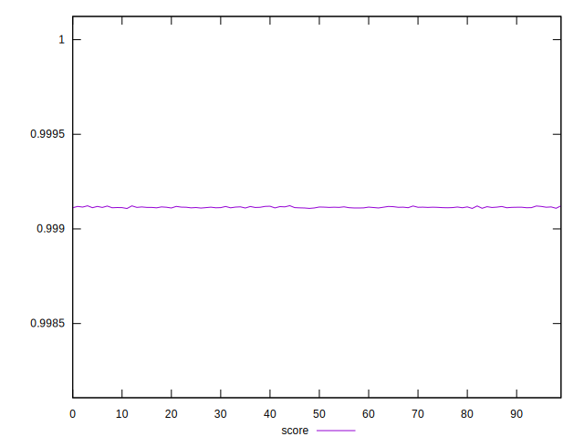
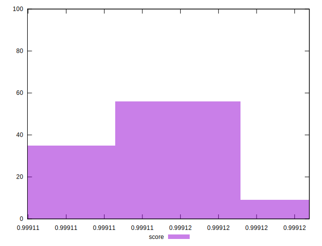

# //first-cpu-idle/samples/pages+cached+noexternal+nofonts+nosvg+noimg+nocss+nojs

[→ Parent](../..)


## Raw


```yaml
p90min: 1507.6709999999998
p90max: 1510.3714
p90range: 2.7004000000001724
p90mean: 1509.0685252747253
p90median: 1509.1147999999998
p90stdev: 0.6229805780038024
p90skewness: -0.28001023305962347
p90eccentricity: 0.9999999999999997
p90discretization: 1.011111111111111
outlandishness: 0.9998261926829626

```


## Score


```yaml
p90min: 0.9991083392741568
p90max: 0.9991198782548187
p90range: 0.000011538980661973675
p90mean: 0.9991139180863264
p90median: 0.9991137234268843
p90stdev: 0.0000026616338863098704
p90skewness: 0.27497640873361906
p90eccentricity: 0.9999999999999999
p90discretization: 1.011111111111111
outlandishness: 1.0000011179961972

```


## P Score


```yaml
p90min: 0.9991083392741568
p90max: 0.9991198782548187
p90range: 0.000011538980661973675
p90mean: 0.9991139180863264
p90median: 0.9991137234268843
p90stdev: 0.0000026616338863098704
p90skewness: 0.27497640873361906
p90eccentricity: 0.9999999999999999
p90discretization: 1.011111111111111
outlandishness: 1.0000011179961972

```


## Score Difference


```yaml
p90min: 0.0008801217451812615
p90max: 0.0008916607258432352
p90range: 0.000011538980661973675
p90mean: 0.0008860819136733056
p90median: 0.0008862765731156852
p90stdev: 0.0000026616338863098704
p90skewness: -0.2749764086923142
p90eccentricity: 1.0000000000000002
p90discretization: 1.011111111111111
outlandishness: 0.9987397855613146

```


## P Score Difference


```yaml
p90min: 0
p90max: 0
p90range: 0
p90mean: 0
p90median: 0
p90stdev: 0
p90skewness: .nan
p90eccentricity: .nan
p90discretization: 91
outlandishness: .nan

```

