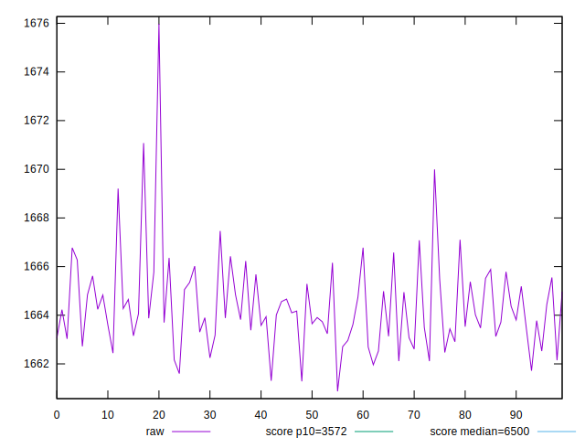
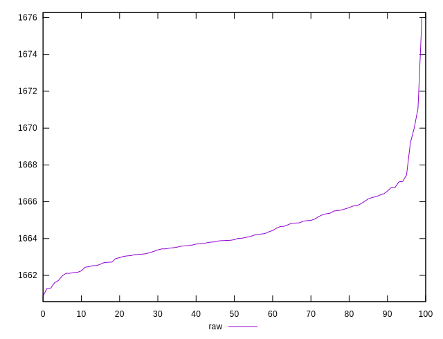
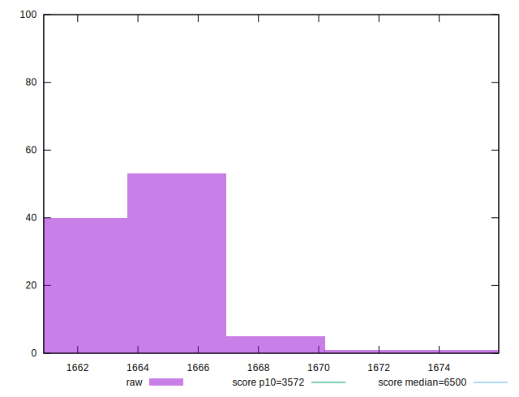
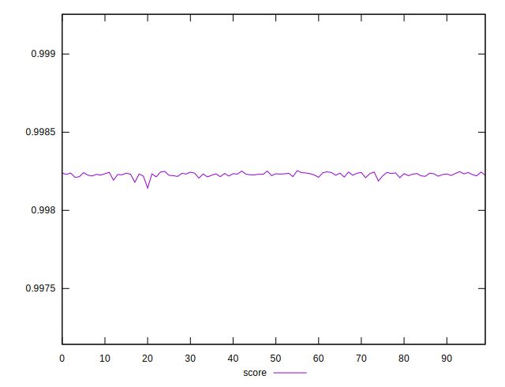
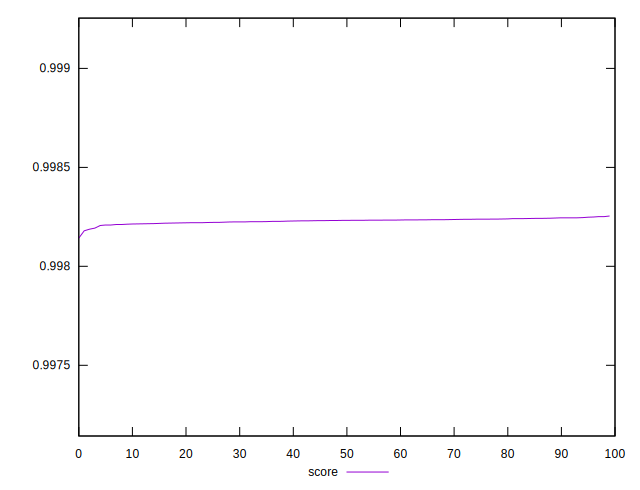
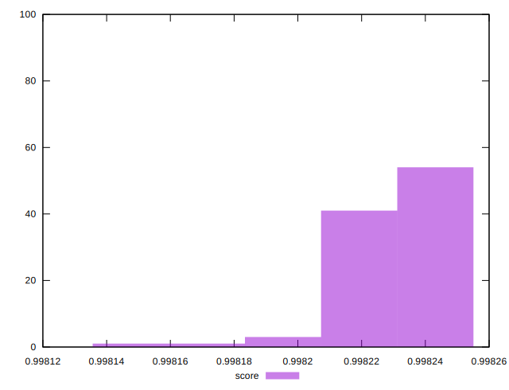

# //first-cpu-idle/samples/pages+cached+noexternal+nofonts+nosvg+noimg+nocss

[→ Parent](../..)


## Raw


```yaml
p90min: 1660.8732000000005
p90max: 1666.4223
p90range: 5.549099999999498
p90mean: 1663.89601
p90median: 1663.81435
p90stdev: 1.2948633277557364
p90skewness: 0.0032481793722274927
p90eccentricity: 1.0000000000000002
p90discretization: 1
outlandishness: 1.000589859392038

```


## Score


```yaml
p90min: 0.9981426585354668
p90max: 0.9982444006060536
p90range: 0.00010174207058677442
p90mean: 0.9982266377767703
p90median: 0.998230670446616
p90stdev: 0.000014863929788226822
p90skewness: -2.6190069825297733
p90eccentricity: 0.9999999999999999
p90discretization: 1
outlandishness: 1.0000043145623405

```

