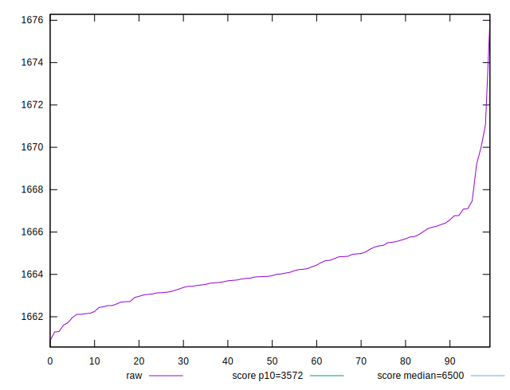
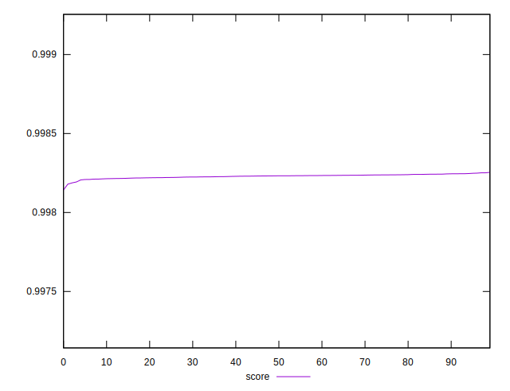
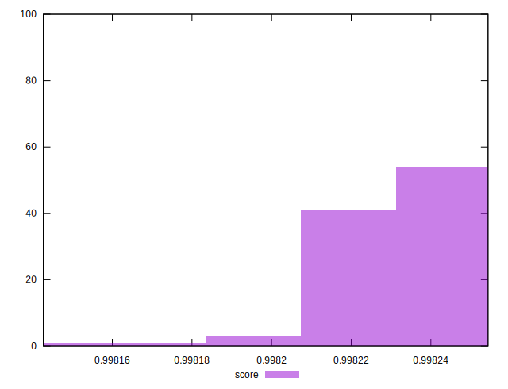

# //first-cpu-idle/samples/pages+cached+noexternal+nofonts+nosvg+noimg+nocss

[→ Parent](../..)


## Raw


```yaml
p90min: 1661.7190999999998
p90max: 1667.1036
p90range: 5.384500000000116
p90mean: 1664.174618681319
p90median: 1663.9063999999998
p90stdev: 1.326305871183827
p90skewness: 0.3396354803807384
p90eccentricity: 1.0000000000000009
p90discretization: 1
outlandishness: 1.0002548588666476

```


## Score


```yaml
p90min: 0.9982089200913472
p90max: 0.9982482382757556
p90range: 0.00003931818440838786
p90mean: 0.9982303702911802
p90median: 0.9982323467761703
p90stdev: 0.000009684464051802448
p90skewness: -0.347000379007583
p90eccentricity: 0.9999999999999997
p90discretization: 1
outlandishness: 0.999996836281481

```

