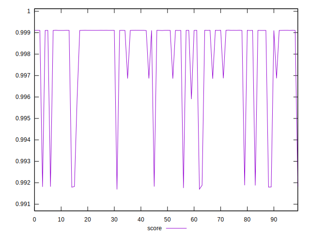

# //first-cpu-idle/samples/pages+cached+noexternal+nofonts+nosvg+noimg

[→ Parent](../..)


## Raw


```yaml
p90min: 1508.0034
p90max: 2117.3809500000007
p90range: 609.3775500000006
p90mean: 1571.7963252747245
p90median: 1510.3378
p90stdev: 159.99083897558123
p90skewness: 2.512672186359603
p90eccentricity: 1
p90discretization: 1
outlandishness: 1.0637104652967722

```


## Score


```yaml
p90min: 0.9918246309334533
p90max: 0.9991184642258293
p90range: 0.007293833292375984
p90mean: 0.998491992526317
p90median: 0.9991084835719645
p90stdev: 0.0017515944942577447
p90skewness: -3.072879003321308
p90eccentricity: 0.9999999999999999
p90discretization: 1
outlandishness: 0.9987896042551052

```


## P Score


```yaml
p90min: 0.9918246309334533
p90max: 0.9991184642258293
p90range: 0.007293833292375984
p90mean: 0.998491992526317
p90median: 0.9991084835719645
p90stdev: 0.0017515944942577447
p90skewness: -3.072879003321308
p90eccentricity: 0.9999999999999999
p90discretization: 1
outlandishness: 0.9987896042551052

```


## Score Difference


```yaml
p90min: -0.0018087563836237663
p90max: 0.0031499243892127993
p90range: 0.004958680772836566
p90mean: 0.0008348293559006079
p90median: 0.0008907561600184355
p90stdev: 0.0009336447130899091
p90skewness: -0.6692043199662472
p90eccentricity: 1.0000000000000002
p90discretization: 1
outlandishness: 0.728357593822468

```


## P Score Difference


```yaml
p90min: 0
p90max: 0
p90range: 0
p90mean: 0
p90median: 0
p90stdev: 0
p90skewness: .nan
p90eccentricity: .nan
p90discretization: 91
outlandishness: .nan

```

