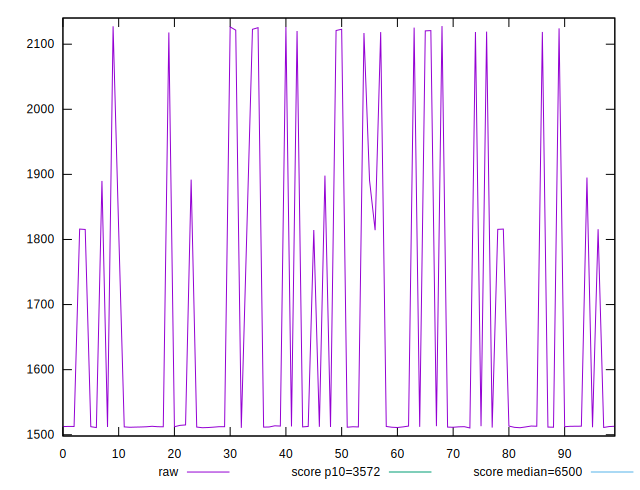
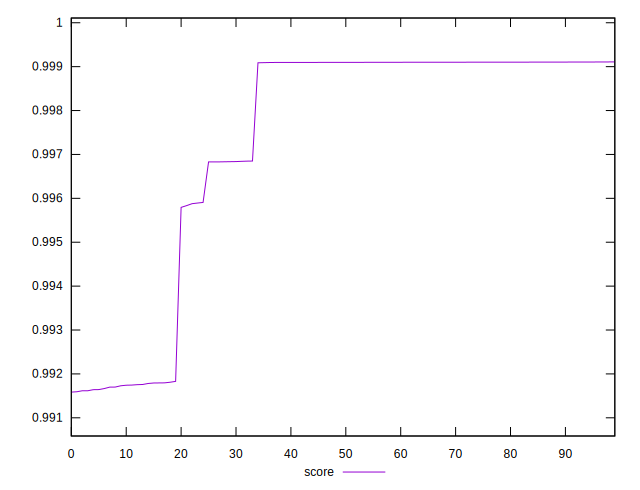

# //first-cpu-idle/samples/pages+cached+noexternal+nofonts

[→ Parent](../..)


## Raw


```yaml
p90min: 1510.4286000000002
p90max: 2121.0107
p90range: 610.5820999999996
p90mean: 1631.1586033333335
p90median: 1512.5775499999997
p90stdev: 209.90516108500736
p90skewness: 1.439887973549556
p90eccentricity: 0.9999999999999999
p90discretization: 1
outlandishness: 1.0614802243177217

```


## Score


```yaml
p90min: 0.9915853859990458
p90max: 0.9991035089698086
p90range: 0.0075181229707628194
p90mean: 0.9970522481614377
p90median: 0.9990966847453868
p90stdev: 0.003003836013537235
p90skewness: -1.0540026932713924
p90eccentricity: 1.0000000000000004
p90discretization: 1
outlandishness: 1.0004119819900932

```

