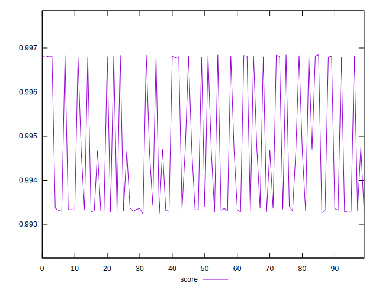

# //first-cpu-idle/samples/pages+cached+noexternal+noimg

[→ Parent](../..)


## Raw


```yaml
p90min: 1814.6572999999999
p90max: 2047.6799499999997
p90range: 233.02264999999989
p90mean: 1944.4616266666653
p90median: 1972.3889
p90stdev: 104.63605322611224
p90skewness: -0.2905399156115366
p90eccentricity: 1
p90discretization: 1
outlandishness: 1.0107758261921214

```


## Score


```yaml
p90min: 0.9932353217589898
p90max: 0.9968193629377601
p90range: 0.003584041178770314
p90mean: 0.9945152572961866
p90median: 0.9933684029347547
p90stdev: 0.001501960111651731
p90skewness: 0.7042006056152086
p90eccentricity: 0.9999999999999999
p90discretization: 1
outlandishness: 1.0004665292244743

```

