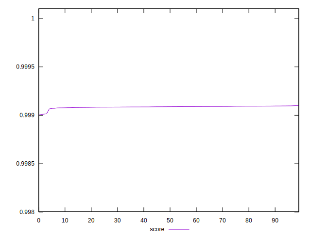

# //first-cpu-idle/samples/pages+cached+noexternal+nojs

[→ Parent](../..)


## Raw


```yaml
p90min: 1512.2695999999999
p90max: 1517.4563999999998
p90range: 5.186799999999948
p90mean: 1514.8051077777775
p90median: 1514.6832
p90stdev: 1.1885165331648417
p90skewness: 0.10835080824635654
p90eccentricity: 1
p90discretization: 1
outlandishness: 1.0012134060542928

```


## Score


```yaml
p90min: 0.9990037462007441
p90max: 0.9990953018380344
p90range: 0.00009155563729035254
p90mean: 0.9990836207073723
p90median: 0.9990880527927101
p90stdev: 0.000016897646447994884
p90skewness: -3.672039569993639
p90eccentricity: 1
p90discretization: 1
outlandishness: 1.000002772765535

```

