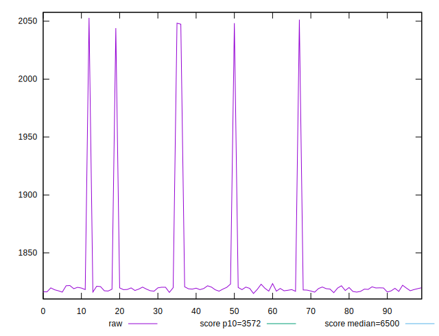
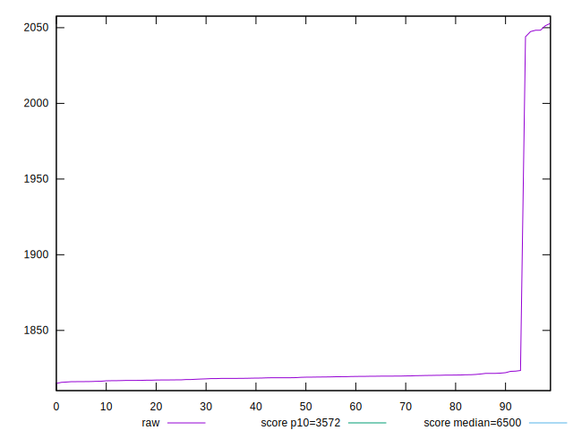

# //first-cpu-idle/samples/pages+cached+noexternal+nosvg

[→ Parent](../..)


## Raw


```yaml
p90min: 1816.1404000000002
p90max: 1823.5164
p90range: 7.375999999999749
p90mean: 1818.9417131868129
p90median: 1818.8148
p90stdev: 1.6868265423575513
p90skewness: 0.3583482763388381
p90eccentricity: 1.0000000000000007
p90discretization: 1
outlandishness: 1.0151030179432818

```


## Score


```yaml
p90min: 0.9967440434023507
p90max: 0.996828492387632
p90range: 0.00008444898528137124
p90mean: 0.9967965712543628
p90median: 0.9967980638415099
p90stdev: 0.00001928277385620116
p90skewness: -0.36929579167015913
p90eccentricity: 1.0000000000000002
p90discretization: 1
outlandishness: 0.9995782579347117

```

