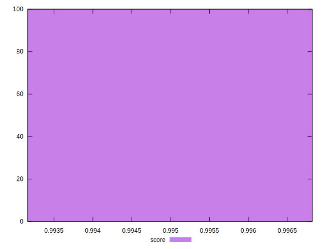

# //first-cpu-idle/samples/pages+cached+noexternal

[→ Parent](../..)


## Raw


```yaml
p90min: 1816.8288000000002
p90max: 2050.72535
p90range: 233.89654999999993
p90mean: 1925.8666177777768
p90median: 1896.54415
p90stdev: 108.45821284236007
p90skewness: 0.10381697655199733
p90eccentricity: 1.0000000000000002
p90discretization: 1
outlandishness: 1.0131663526684793

```


## Score


```yaml
p90min: 0.9931619917360298
p90max: 0.9968011091501947
p90range: 0.003639117414164894
p90mean: 0.9947813434078123
p90median: 0.9939631406438247
p90stdev: 0.0016484439791029158
p90skewness: 0.30108103174467904
p90eccentricity: 0.9999999999999997
p90discretization: 1
outlandishness: 1.0004083150276077

```

