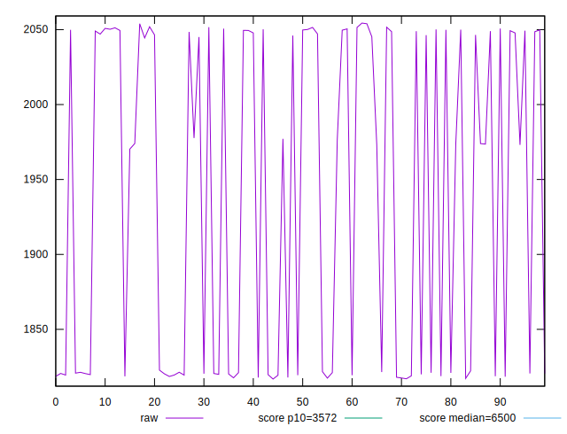
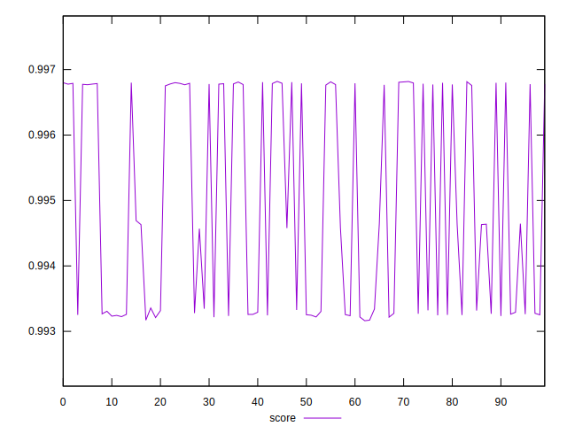
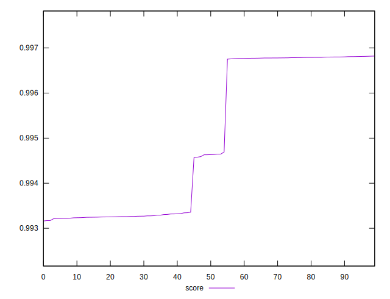

# //first-cpu-idle/samples/pages+cached+noexternal

[→ Parent](../..)


## Raw


```yaml
p90min: 1818.3901999999998
p90max: 2054.36825
p90range: 235.97805000000017
p90mean: 1950.471074725274
p90median: 1977.6609999999998
p90stdev: 107.80563715983902
p90skewness: -0.31452020950890935
p90eccentricity: 0.9999999999999997
p90discretization: 1
outlandishness: 0.9877661537174199

```


## Score


```yaml
p90min: 0.9931619917360298
p90max: 0.9968029092942965
p90range: 0.0036409175582666764
p90mean: 0.9948035584175543
p90median: 0.9945691997069909
p90stdev: 0.0016528526762998497
p90skewness: 0.27517811784288815
p90eccentricity: 1.0000000000000002
p90discretization: 1
outlandishness: 1.0003636351867833

```

