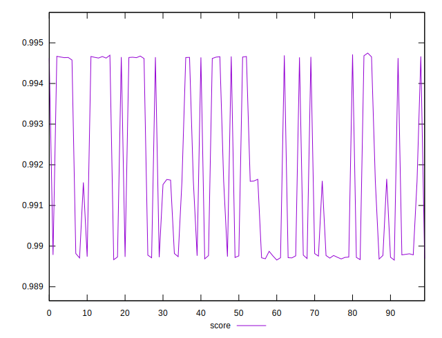
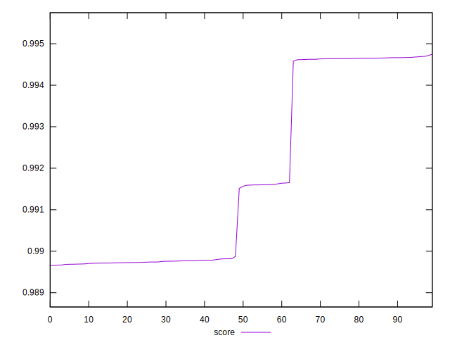

# //first-cpu-idle/samples/pages+cached+nointeractive

[→ Parent](../..)


## Raw


```yaml
p90min: 1971.9841000000001
p90max: 2205.583
p90range: 233.59889999999996
p90mean: 2120.3966010989006
p90median: 2199.5329499999993
p90stdev: 101.37623183280772
p90skewness: -0.6512574334076272
p90eccentricity: 0.9999999999999999
p90discretization: 1
outlandishness: 0.9873123635409286

```


## Score


```yaml
p90min: 0.9896559295246983
p90max: 0.9946642199017626
p90range: 0.005008290377064295
p90mean: 0.9915337695045211
p90median: 0.9898162423445476
p90stdev: 0.0021688943298278952
p90skewness: 0.5981171710905584
p90eccentricity: 1
p90discretization: 1
outlandishness: 1.000572961571507

```


## P Score


```yaml
p90min: 0.9896559295246983
p90max: 0.9946642199017626
p90range: 0.005008290377064295
p90mean: 0.9915337695045211
p90median: 0.9898162423445476
p90stdev: 0.0021688943298278952
p90skewness: 0.5981171710905584
p90eccentricity: 1
p90discretization: 1
outlandishness: 1.000572961571507

```


## Score Difference


```yaml
p90min: -0.0046642199017625785
p90max: 0.00034407047530171653
p90range: 0.005008290377064295
p90mean: -0.0015337695045206242
p90median: 0.00018375765545242118
p90stdev: 0.0021688943298278952
p90skewness: -0.5981171710907692
p90eccentricity: 1
p90discretization: 1
outlandishness: 1.404638125208569

```


## P Score Difference


```yaml
p90min: 0
p90max: 0
p90range: 0
p90mean: 0
p90median: 0
p90stdev: 0
p90skewness: .nan
p90eccentricity: .nan
p90discretization: 91
outlandishness: .nan

```

