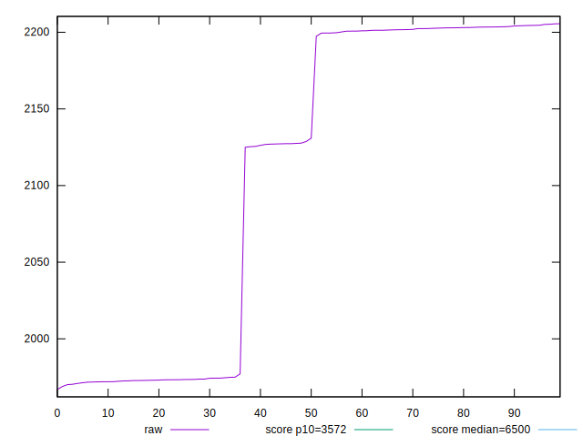

# //first-cpu-idle/samples/pages+cached+nointeractive

[→ Parent](../..)


## Raw


```yaml
p90min: 1966.9283
p90max: 2203.7442
p90range: 236.81590000000006
p90mean: 2096.028120555556
p90median: 2127.27495
p90stdev: 106.08893336952517
p90skewness: -0.21165883631809054
p90eccentricity: 1
p90discretization: 1
outlandishness: 1.01040285449162

```


## Score


```yaml
p90min: 0.9896559295246983
p90max: 0.9946632901760516
p90range: 0.005007360651353321
p90mean: 0.991498986722329
p90median: 0.9898136552603858
p90stdev: 0.0021555219332021606
p90skewness: 0.6304677324749055
p90eccentricity: 0.9999999999999997
p90discretization: 1
outlandishness: 1.000643165015611

```

