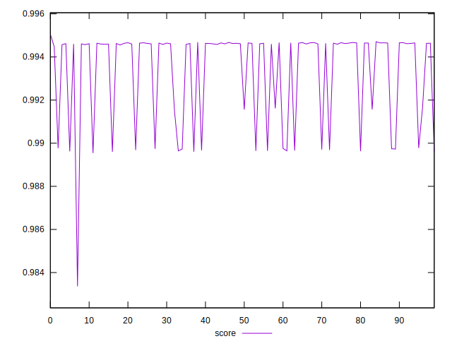

# //first-cpu-idle/samples/pages+cached

[→ Parent](../..)


## Raw


```yaml
p90min: 1947.971
p90max: 2206.01295
p90range: 258.0419499999998
p90mean: 2015.5045805555558
p90median: 1974.4517500000002
p90stdev: 84.87216790201788
p90skewness: 1.5986264469800668
p90eccentricity: 1.0000000000000004
p90discretization: 1
outlandishness: 1.0210767003967527

```


## Score


```yaml
p90min: 0.9833619866068815
p90max: 0.9946622588578184
p90range: 0.011300272250936994
p90mean: 0.9931184064932165
p90median: 0.9946076353491056
p90stdev: 0.002375949294544363
p90skewness: -1.3549033955023158
p90eccentricity: 0.9999999999999996
p90discretization: 1
outlandishness: 1.000321023765583

```

