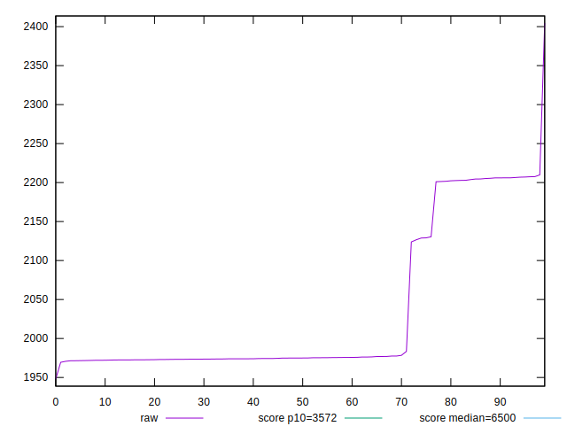
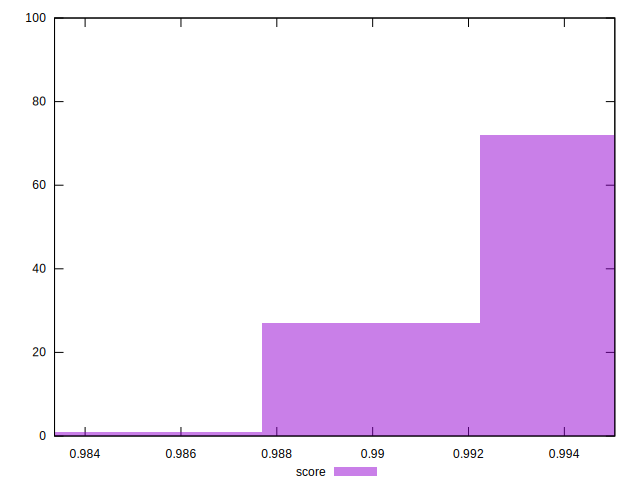

# //first-cpu-idle/samples/pages+cached

[→ Parent](../..)


## Raw


```yaml
p90min: 1947.971
p90max: 2206.02145
p90range: 258.0504500000002
p90mean: 2017.598172527473
p90median: 1974.5679000000002
p90stdev: 86.70991505402115
p90skewness: 1.5267592457492085
p90eccentricity: 1.0000000000000002
p90discretization: 1
outlandishness: 1.0189587277561352

```


## Score


```yaml
p90min: 0.9896442437660908
p90max: 0.9950528285962085
p90range: 0.005408584830117635
p90mean: 0.9937089106914421
p90median: 0.9946211231540849
p90stdev: 0.001840904082027137
p90skewness: -1.5609826077592728
p90eccentricity: 0.9999999999999993
p90discretization: 1
outlandishness: 0.99913251020785

```

