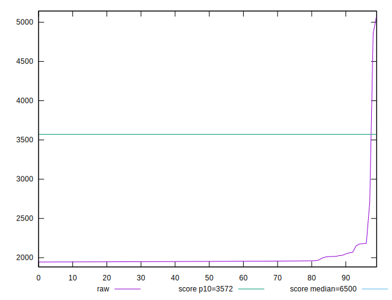
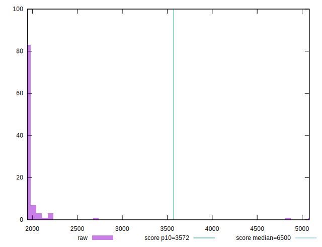

# //first-cpu-idle/samples/pages

[→ Parent](../..)


## Raw


```yaml
p90min: 1945.0035000000003
p90max: 2030.041
p90range: 85.03749999999968
p90mean: 1956.692827777778
p90median: 1952.00975
p90stdev: 17.7913795566469
p90skewness: 2.9450496241556343
p90eccentricity: 0.999999999999999
p90discretization: 1
outlandishness: 1.082888090630233

```


## Score


```yaml
p90min: 0.701132553722267
p90max: 0.9950791497172384
p90range: 0.2939465959949714
p90mean: 0.988179065808846
p90median: 0.9949677528641641
p90stdev: 0.04101416411101162
p90skewness: -6.472225103654577
p90eccentricity: 1.0000000000000002
p90discretization: 1
outlandishness: 1.0013991934133353

```

