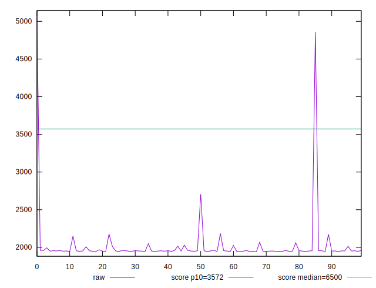
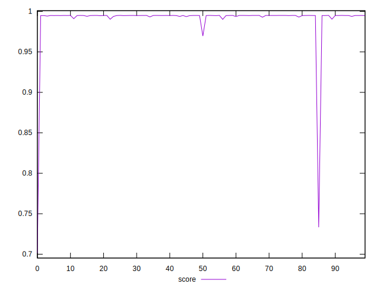
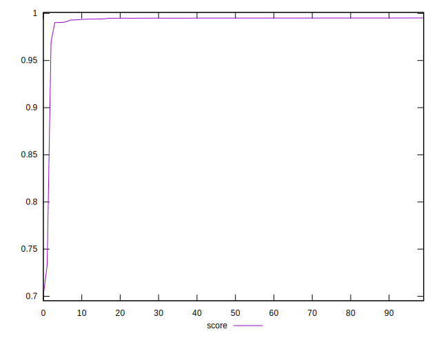

# //first-cpu-idle/samples/pages

[→ Parent](../..)


## Raw


```yaml
p90min: 1945.1764999999998
p90max: 2069.29
p90range: 124.11350000000016
p90mean: 1960.350219780219
p90median: 1952.1359999999997
p90stdev: 25.49237858689594
p90skewness: 2.7862943267015137
p90eccentricity: 1.0000000000000002
p90discretization: 1
outlandishness: 1.0788512081992623

```


## Score


```yaml
p90min: 0.9902054559997523
p90max: 0.995087227320148
p90range: 0.004881771320395689
p90mean: 0.9946412241556873
p90median: 0.9949731533784785
p90stdev: 0.0009937901068743382
p90skewness: -3.352944536473413
p90eccentricity: 0.9999999999999993
p90discretization: 1
outlandishness: 0.9884293337504945

```

