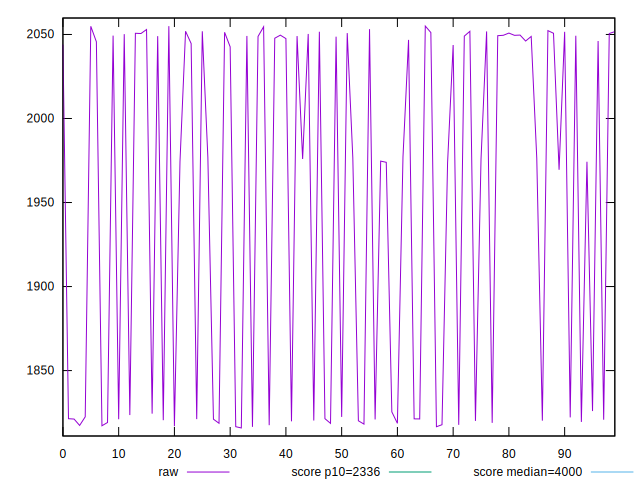
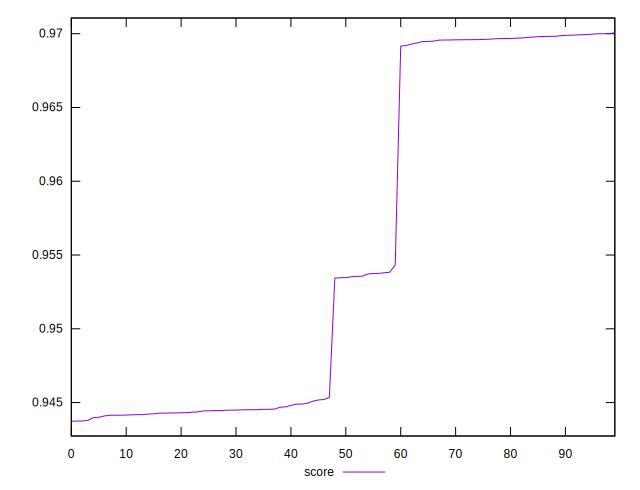

# //first-meaningful-paint/samples/pages+cached+noadtech

[→ Parent](../..)


## Raw


```yaml
p90min: 1817.7876000000003
p90max: 2055.00835
p90range: 237.22074999999973
p90mean: 1961.9513296703299
p90median: 2043.9419500000004
p90stdev: 104.29561249191438
p90skewness: -0.5266544508091479
p90eccentricity: 1.0000000000000002
p90discretization: 1
outlandishness: 0.986737393108723

```


## Score


```yaml
p90min: 0.943734639643558
p90max: 0.9698903102763937
p90range: 0.026155670632835748
p90mean: 0.9542197939387779
p90median: 0.9451769684034028
p90stdev: 0.011469120129604212
p90skewness: 0.4925828956348305
p90eccentricity: 0.9999999999999999
p90discretization: 1
outlandishness: 1.0029730190304784

```


## P Score


```yaml
p90min: 0.943734639643558
p90max: 0.9698903102763937
p90range: 0.026155670632835748
p90mean: 0.9542197939387779
p90median: 0.9451769684034028
p90stdev: 0.011469120129604212
p90skewness: 0.4925828956348305
p90eccentricity: 0.9999999999999999
p90discretization: 1
outlandishness: 1.0029730190304784

```


## Score Difference


```yaml
p90min: -0.004808631107555361
p90max: 0.0007022334000892361
p90range: 0.005510864507644597
p90mean: -0.0023054154312484726
p90median: -0.0037346396435579132
p90stdev: 0.0022110815400341118
p90skewness: 0.29729286195553944
p90eccentricity: 0.9999999999999999
p90discretization: 1
outlandishness: 0.7808508802446966

```


## P Score Difference


```yaml
p90min: 0
p90max: 0
p90range: 0
p90mean: 0
p90median: 0
p90stdev: 0
p90skewness: .nan
p90eccentricity: .nan
p90discretization: 91
outlandishness: .nan

```

