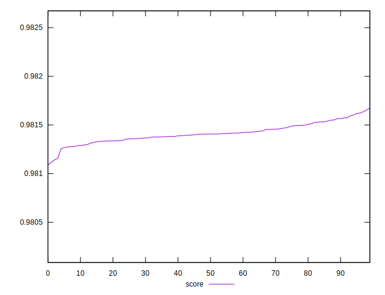

# //first-meaningful-paint/samples/pages+cached+noexternal+nocss

[→ Parent](../..)


## Raw


```yaml
p90min: 1665.2136999999998
p90max: 1670.5841999999998
p90range: 5.370499999999993
p90mean: 1668.1580043956042
p90median: 1668.2639
p90stdev: 1.267550657106961
p90skewness: -0.34557371829790234
p90eccentricity: 1
p90discretization: 1
outlandishness: 1.0000012284264546

```


## Score


```yaml
p90min: 0.9812554197217209
p90max: 0.9816041883864919
p90range: 0.0003487686647709598
p90mean: 0.9814134082003518
p90median: 0.9814066501598829
p90stdev: 0.00008232458983810561
p90skewness: 0.33924917266510585
p90eccentricity: 1.0000000000000002
p90discretization: 1
outlandishness: 0.9999996658780751

```


## P Score


```yaml
p90min: 0.9812554197217209
p90max: 0.9816041883864919
p90range: 0.0003487686647709598
p90mean: 0.9814134082003518
p90median: 0.9814066501598829
p90stdev: 0.00008232458983810561
p90skewness: 0.33924917266510585
p90eccentricity: 1.0000000000000002
p90discretization: 1
outlandishness: 0.9999996658780751

```


## Score Difference


```yaml
p90min: -0.0016041883864919004
p90max: -0.0012554197217209406
p90range: 0.0003487686647709598
p90mean: -0.0014134082003514656
p90median: -0.0014066501598829495
p90stdev: 0.00008232458983810564
p90skewness: -0.33924917265083443
p90eccentricity: 1
p90discretization: 1
outlandishness: 0.9997680127048207

```


## P Score Difference


```yaml
p90min: 0
p90max: 0
p90range: 0
p90mean: 0
p90median: 0
p90stdev: 0
p90skewness: .nan
p90eccentricity: .nan
p90discretization: 91
outlandishness: .nan

```

