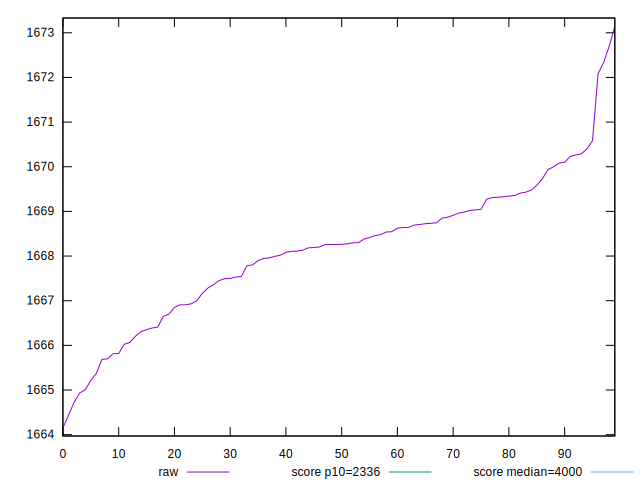

# //first-meaningful-paint/samples/pages+cached+noexternal+nocss

[→ Parent](../..)


## Raw


```yaml
p90min: 1664.1504999999997
p90max: 1670.0817999999997
p90range: 5.931299999999965
p90mean: 1667.819527777778
p90median: 1668.1874000000003
p90stdev: 1.3742395769643214
p90skewness: -0.7281443714673721
p90eccentricity: 1.0000000000000009
p90discretization: 1
outlandishness: 1.0004071612917225

```


## Score


```yaml
p90min: 0.9810871652402663
p90max: 0.9815651729107868
p90range: 0.0004780076705205305
p90mean: 0.9813912415773206
p90median: 0.9813979910646855
p90stdev: 0.00009212930177025684
p90skewness: -0.7598544442942359
p90eccentricity: 1.0000000000000002
p90discretization: 1
outlandishness: 1.0000448402489557

```

