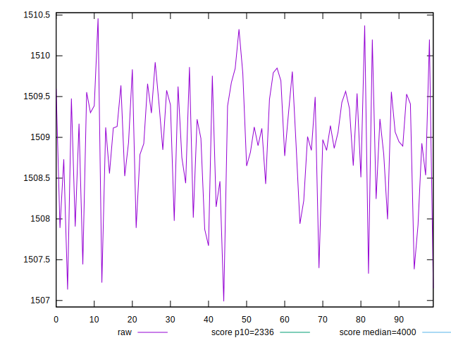
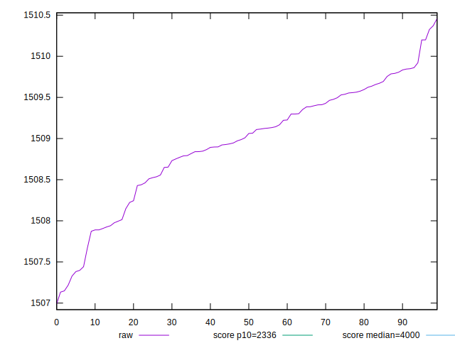
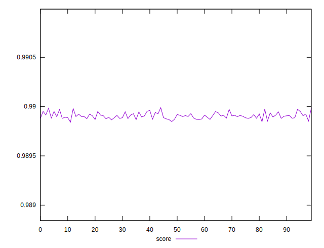

# //first-meaningful-paint/samples/pages+cached+noexternal+nofonts+nosvg+noimg+nocss+nojs

[→ Parent](../..)


## Raw


```yaml
p90min: 1506.9898
p90max: 1509.8064
p90range: 2.8165999999998803
p90mean: 1508.8097111111108
p90median: 1508.9313000000002
p90stdev: 0.7209482398502817
p90skewness: -0.7865169017680431
p90eccentricity: 1.0000000000000002
p90discretization: 1.0112359550561798
outlandishness: 1.0001692331233056

```


## Score


```yaml
p90min: 0.9898424762111055
p90max: 0.989951563206973
p90range: 0.00010908699586742454
p90mean: 0.9898997124730833
p90median: 0.9898992306337027
p90stdev: 0.000025967906335378642
p90skewness: 0.16629171716977814
p90eccentricity: 0.9999999999999993
p90discretization: 1.0112359550561798
outlandishness: 1.0000150081927979

```

