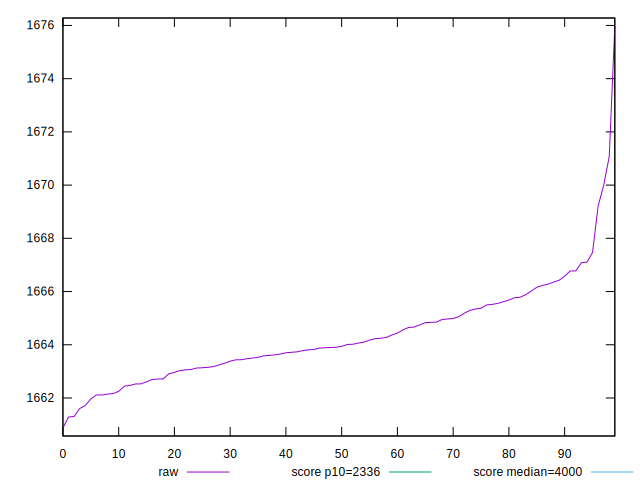
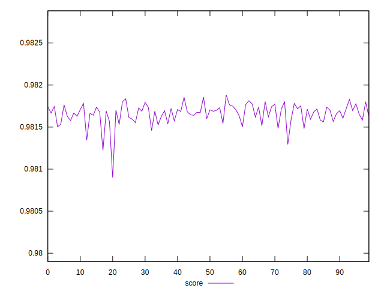

# //first-meaningful-paint/samples/pages+cached+noexternal+nofonts+nosvg+noimg+nocss

[→ Parent](../..)


## Raw


```yaml
p90min: 1661.7190999999998
p90max: 1667.1036
p90range: 5.384500000000116
p90mean: 1664.174618681319
p90median: 1663.9063999999998
p90stdev: 1.326305871183827
p90skewness: 0.3396354803807384
p90eccentricity: 1.0000000000000009
p90discretization: 1
outlandishness: 1.0002548588666476

```


## Score


```yaml
p90min: 0.9814819631106475
p90max: 0.9818287456581712
p90range: 0.0003467825475237385
p90mean: 0.9816710189174349
p90median: 0.9816884132557956
p90stdev: 0.00008541687983831311
p90skewness: -0.3452240637082445
p90eccentricity: 1.0000000000000002
p90discretization: 1
outlandishness: 0.9999717596739124

```


## P Score


```yaml
p90min: 0.9814819631106475
p90max: 0.9818287456581712
p90range: 0.0003467825475237385
p90mean: 0.9816710189174349
p90median: 0.9816884132557956
p90stdev: 0.00008541687983831311
p90skewness: -0.3452240637082445
p90eccentricity: 1.0000000000000002
p90discretization: 1
outlandishness: 0.9999717596739124

```


## Score Difference


```yaml
p90min: -0.0018287456581712602
p90max: -0.0014819631106475217
p90range: 0.0003467825475237385
p90mean: -0.0016710189174349885
p90median: -0.0016884132557956066
p90stdev: 0.0000854168798383131
p90skewness: 0.3452240637103008
p90eccentricity: 1.0000000000000002
p90discretization: 1
outlandishness: 0.9834783906604299

```


## P Score Difference


```yaml
p90min: 0
p90max: 0
p90range: 0
p90mean: 0
p90median: 0
p90stdev: 0
p90skewness: .nan
p90eccentricity: .nan
p90discretization: 91
outlandishness: .nan

```

