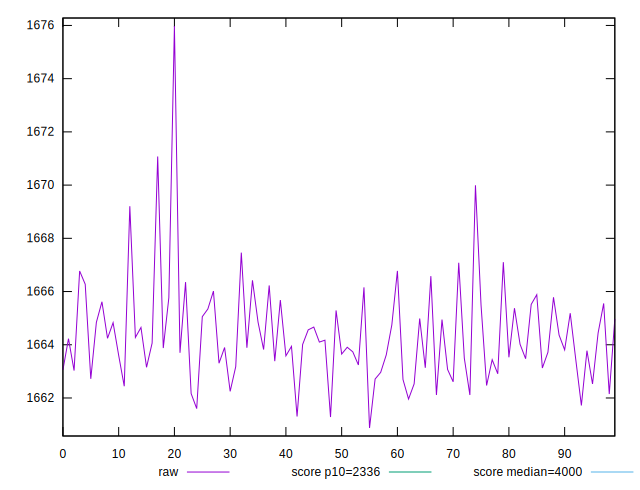
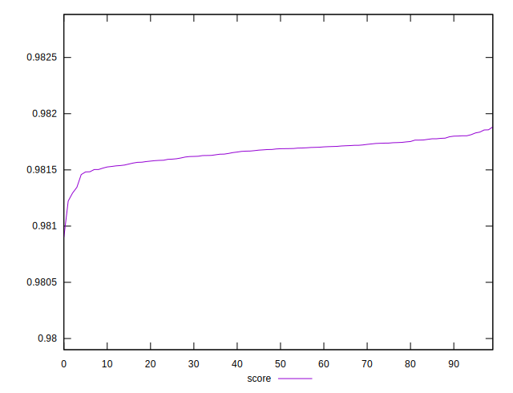
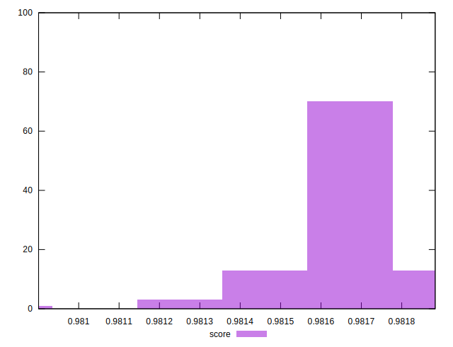

# //first-meaningful-paint/samples/pages+cached+noexternal+nofonts+nosvg+noimg+nocss

[→ Parent](../..)


## Raw


```yaml
p90min: 1660.8732000000005
p90max: 1666.4223
p90range: 5.549099999999498
p90mean: 1663.89601
p90median: 1663.81435
p90stdev: 1.2948633277557364
p90skewness: 0.0032481793722274927
p90eccentricity: 1.0000000000000002
p90discretization: 1
outlandishness: 1.000589859392038

```


## Score


```yaml
p90min: 0.9809007034010104
p90max: 0.9817948351318051
p90range: 0.0008941317307946672
p90mean: 0.9816381563918286
p90median: 0.9816736237683554
p90stdev: 0.00013081012765026528
p90skewness: -2.6059061847809875
p90eccentricity: 1
p90discretization: 1
outlandishness: 1.0000387133622983

```

