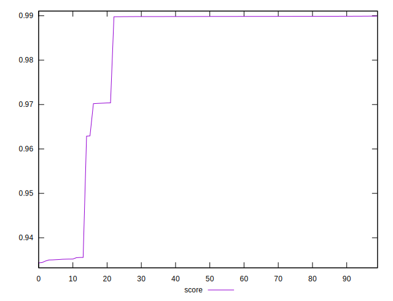
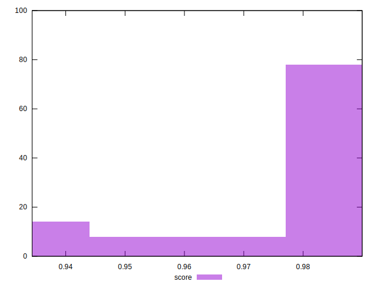

# //first-meaningful-paint/samples/pages+cached+noexternal+nofonts+nosvg+noimg

[→ Parent](../..)


## Raw


```yaml
p90min: 1508.0034
p90max: 2117.3809500000007
p90range: 609.3775500000006
p90mean: 1571.7963252747245
p90median: 1510.3378
p90stdev: 159.99083897558123
p90skewness: 2.512672186359603
p90eccentricity: 1
p90discretization: 1
outlandishness: 1.0637104652967722

```


## Score


```yaml
p90min: 0.9351994674345541
p90max: 0.9899467495008307
p90range: 0.05474728206627666
p90mean: 0.9849817901657817
p90median: 0.9898476408385009
p90stdev: 0.013427326589156602
p90skewness: -2.908057587829031
p90eccentricity: 1.0000000000000002
p90discretization: 1
outlandishness: 0.9908672107721406

```

