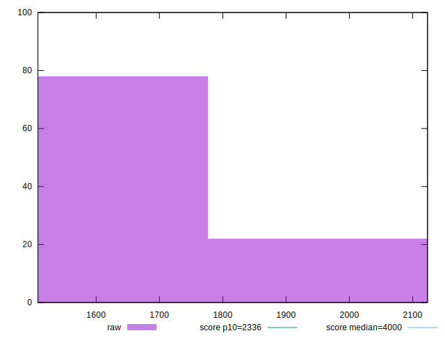
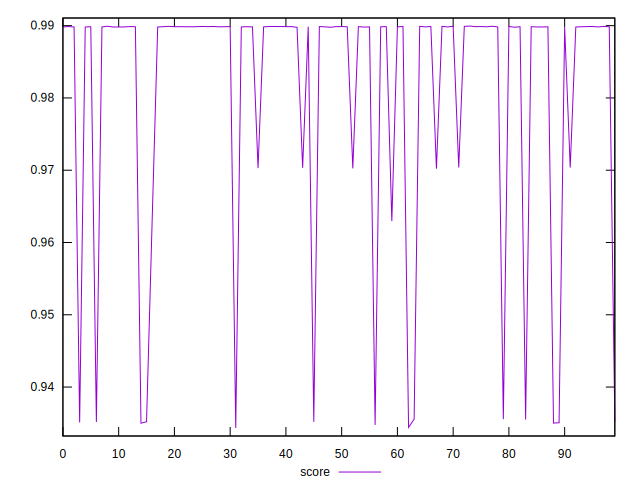

# //first-meaningful-paint/samples/pages+cached+noexternal+nofonts+nosvg+noimg

[→ Parent](../..)


## Raw


```yaml
p90min: 1508.0034
p90max: 2117.36695
p90range: 609.36355
p90mean: 1565.7342738888885
p90median: 1510.33555
p90stdev: 150.12451475873164
p90skewness: 2.663027181166777
p90eccentricity: 0.9999999999999999
p90discretization: 1
outlandishness: 1.0719631432671546

```


## Score


```yaml
p90min: 0.9343390964023497
p90max: 0.9898899947779837
p90range: 0.055550898375633984
p90mean: 0.9794251025036192
p90median: 0.9898300448073367
p90stdev: 0.019990835795766413
p90skewness: -1.6106192335550582
p90eccentricity: 1.0000000000000002
p90discretization: 1
outlandishness: 1.0021423115190755

```

