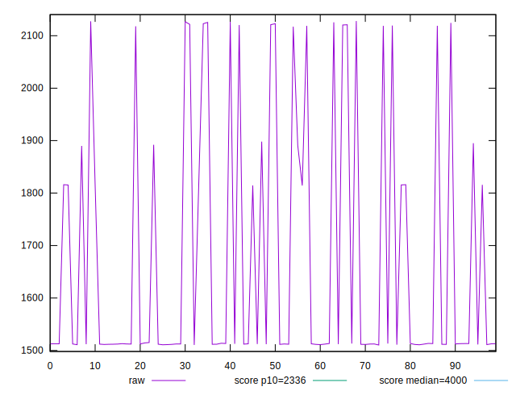
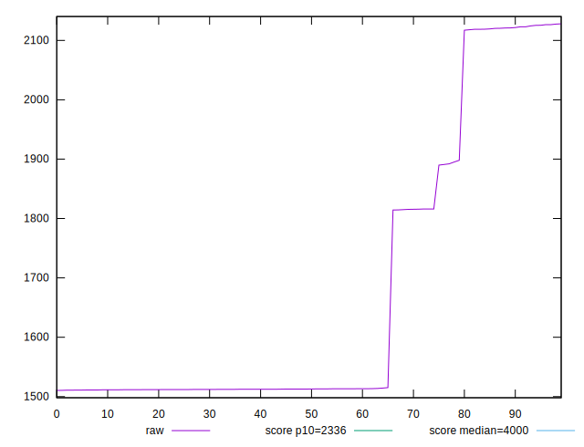
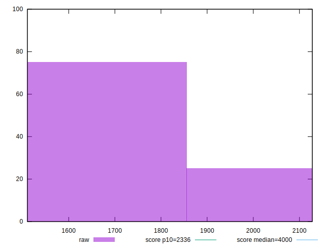
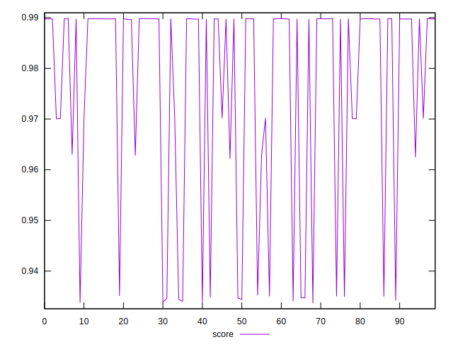
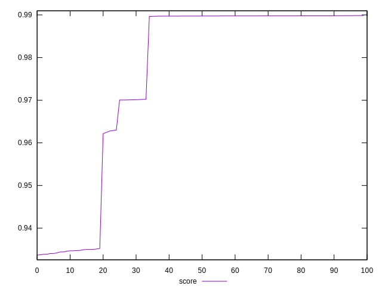
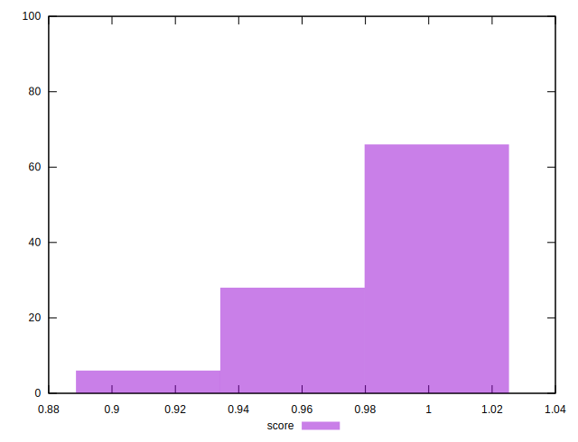

# //first-meaningful-paint/samples/pages+cached+noexternal+nofonts

[→ Parent](../..)


## Raw


```yaml
p90min: 1510.4286000000002
p90max: 2121.58605
p90range: 611.1574499999997
p90mean: 1636.5479159340653
p90median: 1512.6099999999997
p90stdev: 214.9186381226493
p90skewness: 1.3820440854927267
p90eccentricity: 0.9999999999999999
p90discretization: 1
outlandishness: 1.0545006188147241

```


## Score


```yaml
p90min: 0.9345993493083513
p90max: 0.9898437718055635
p90range: 0.055244422497212176
p90mean: 0.9796996658371471
p90median: 0.9897505042390992
p90stdev: 0.018473255984053503
p90skewness: -1.6645173559629793
p90eccentricity: 1.0000000000000009
p90discretization: 1
outlandishness: 0.9916283932495901

```

