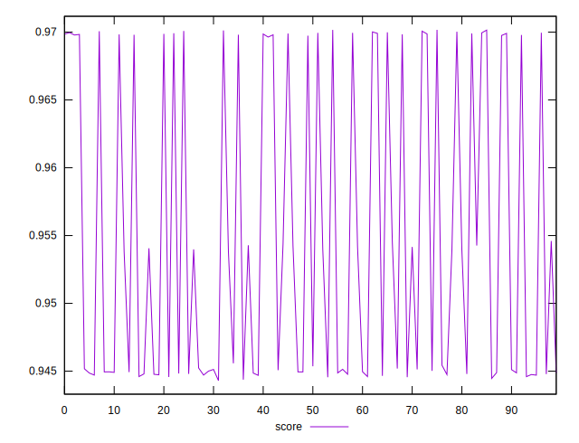

# //first-meaningful-paint/samples/pages+cached+noexternal+noimg

[→ Parent](../..)


## Raw


```yaml
p90min: 1814.6572999999999
p90max: 2047.6799499999997
p90range: 233.02264999999989
p90mean: 1944.4616266666653
p90median: 1972.3889
p90stdev: 104.63605322611224
p90skewness: -0.2905399156115366
p90eccentricity: 1
p90discretization: 1
outlandishness: 1.0107758261921214

```


## Score


```yaml
p90min: 0.9443030417368379
p90max: 0.9699656449742463
p90range: 0.025662603237408432
p90mean: 0.9533542571649546
p90median: 0.9451854723966114
p90stdev: 0.010761979899053437
p90skewness: 0.728058551974607
p90eccentricity: 1.0000000000000002
p90discretization: 1
outlandishness: 1.0035134491506208

```

