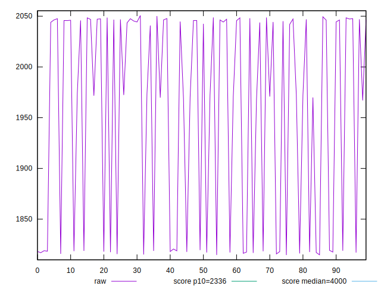
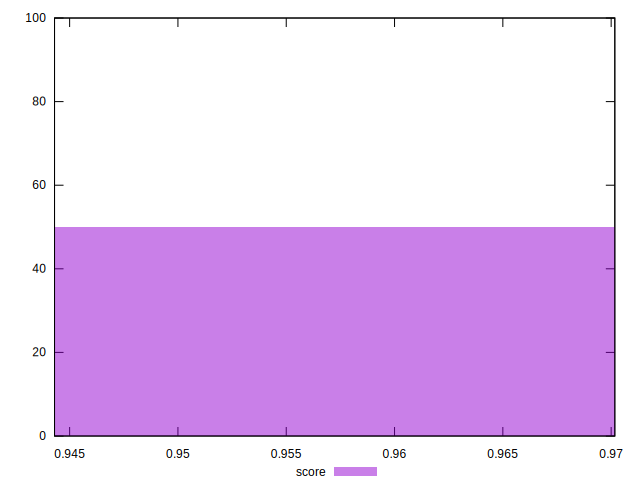

# //first-meaningful-paint/samples/pages+cached+noexternal+noimg

[→ Parent](../..)


## Raw


```yaml
p90min: 1816.7107999999996
p90max: 2050.66715
p90range: 233.9563500000006
p90mean: 1968.702523626373
p90median: 2043.8113499999997
p90stdev: 98.96706850308051
p90skewness: -0.7407006475096194
p90eccentricity: 0.9999999999999997
p90discretization: 1
outlandishness: 0.9860374378698534

```


## Score


```yaml
p90min: 0.9443030417368379
p90max: 0.9699865397924918
p90range: 0.025683498055653953
p90mean: 0.9535370295015204
p90median: 0.9451938599750356
p90stdev: 0.010842231191209431
p90skewness: 0.693279437679504
p90eccentricity: 1.0000000000000004
p90discretization: 1
outlandishness: 1.0031287825589421

```

