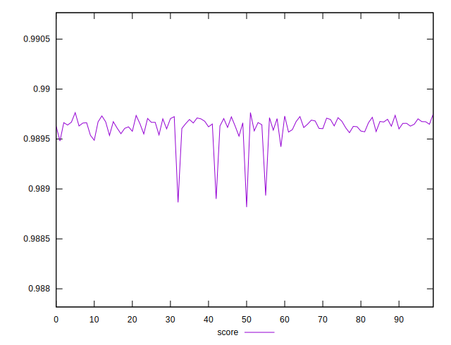
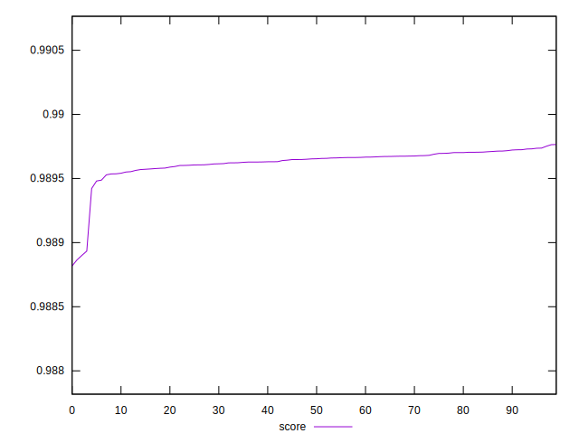

# //first-meaningful-paint/samples/pages+cached+noexternal+nojs

[→ Parent](../..)


## Raw


```yaml
p90min: 1512.2695999999999
p90max: 1517.4563999999998
p90range: 5.186799999999948
p90mean: 1514.8051077777775
p90median: 1514.6832
p90stdev: 1.1885165331648417
p90skewness: 0.10835080824635654
p90eccentricity: 1
p90discretization: 1
outlandishness: 1.0012134060542928

```


## Score


```yaml
p90min: 0.9888178938524337
p90max: 0.9897170153198775
p90range: 0.0008991214674438641
p90mean: 0.9896017552616052
p90median: 0.9896453099642822
p90stdev: 0.00016602880214696574
p90skewness: -3.663816219055194
p90eccentricity: 1.0000000000000004
p90discretization: 1
outlandishness: 1.000027636519792

```

