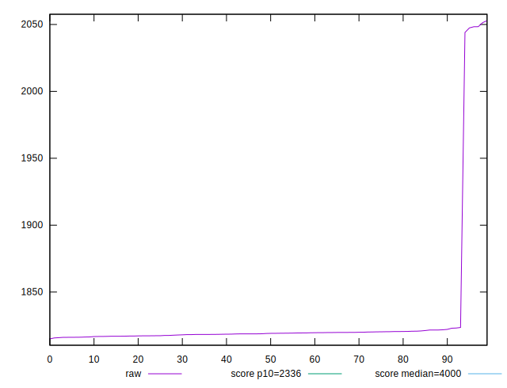
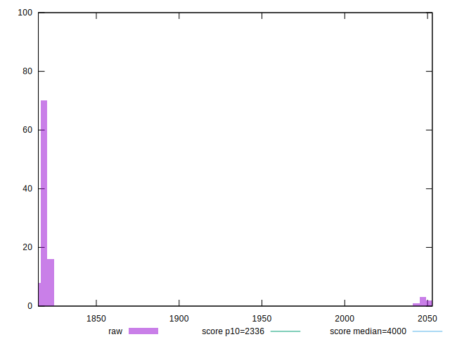
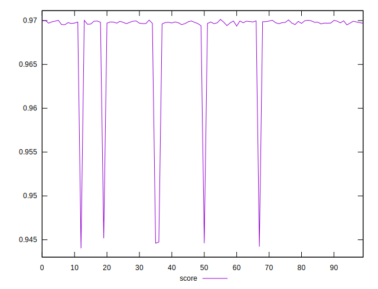
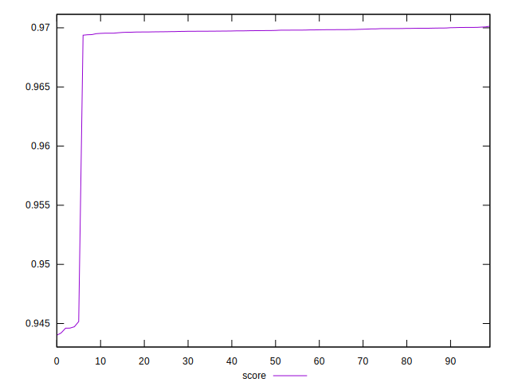

# //first-meaningful-paint/samples/pages+cached+noexternal+nosvg

[→ Parent](../..)


## Raw


```yaml
p90min: 1816.1404000000002
p90max: 1823.5164
p90range: 7.375999999999749
p90mean: 1818.9417131868129
p90median: 1818.8148
p90stdev: 1.6868265423575513
p90skewness: 0.3583482763388381
p90eccentricity: 1.0000000000000007
p90discretization: 1
outlandishness: 1.0151030179432818

```


## Score


```yaml
p90min: 0.9693750106263412
p90max: 0.9700374339037298
p90range: 0.0006624232773885241
p90mean: 0.9697867076178129
p90median: 0.9697983283871681
p90stdev: 0.00015132172322719726
p90skewness: -0.36620587357208534
p90eccentricity: 1.0000000000000004
p90discretization: 1
outlandishness: 0.9968993116107607

```


## P Score


```yaml
p90min: 0.9693750106263412
p90max: 0.9700374339037298
p90range: 0.0006624232773885241
p90mean: 0.9697867076178129
p90median: 0.9697983283871681
p90stdev: 0.00015132172322719726
p90skewness: -0.36620587357208534
p90eccentricity: 1.0000000000000004
p90discretization: 1
outlandishness: 0.9968993116107607

```


## Score Difference


```yaml
p90min: -0.00013948233317440106
p90max: 0.0004959798249122294
p90range: 0.0006354621580866304
p90mean: 0.00019061460109943135
p90median: 0.00019649104452201804
p90stdev: 0.0001437017488141837
p90skewness: -0.05170870242709751
p90eccentricity: 1.0000000000000007
p90discretization: 1
outlandishness: 0.008880523491760118

```


## P Score Difference


```yaml
p90min: 0
p90max: 0
p90range: 0
p90mean: 0
p90median: 0
p90stdev: 0
p90skewness: .nan
p90eccentricity: .nan
p90discretization: 91
outlandishness: .nan

```

