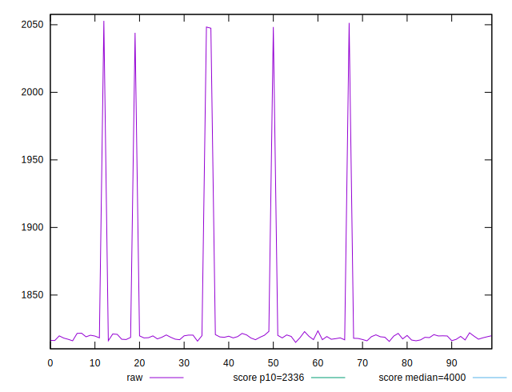
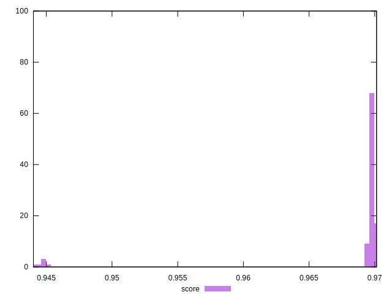

# //first-meaningful-paint/samples/pages+cached+noexternal+nosvg

[→ Parent](../..)


## Raw


```yaml
p90min: 1814.9948000000002
p90max: 1821.7988
p90range: 6.80399999999986
p90mean: 1818.6512044444444
p90median: 1818.7495000000001
p90stdev: 1.5718512185679605
p90skewness: -0.10195276636573486
p90eccentricity: 1.0000000000000002
p90discretization: 1
outlandishness: 1.0154273460536454

```


## Score


```yaml
p90min: 0.944014244639886
p90max: 0.969985039963794
p90range: 0.025970795323908002
p90mean: 0.9680859122968888
p90median: 0.9697561679108468
p90stdev: 0.006290733863986162
p90skewness: -3.4730128596739243
p90eccentricity: 1
p90discretization: 1
outlandishness: 1.0004052217032375

```

