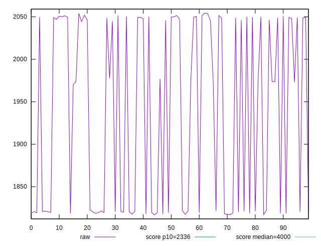
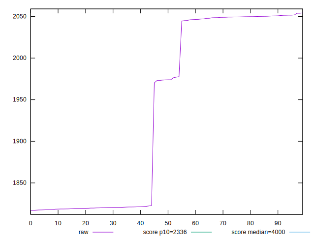
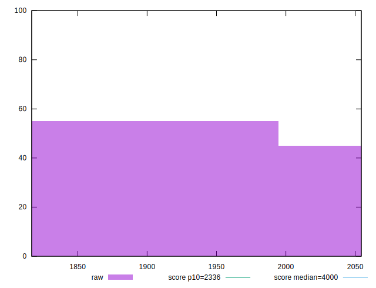
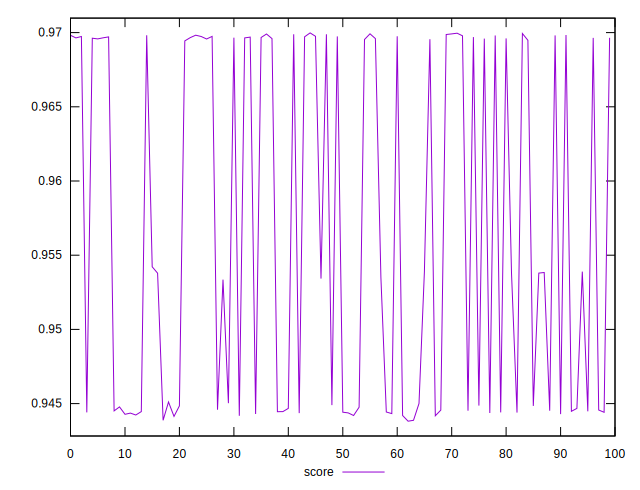
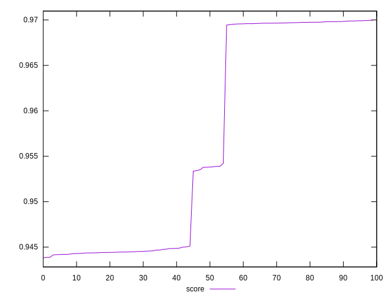
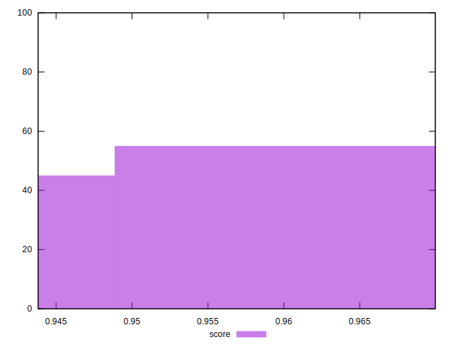

# //first-meaningful-paint/samples/pages+cached+noexternal

[→ Parent](../..)


## Raw


```yaml
p90min: 1816.8288000000002
p90max: 2050.72535
p90range: 233.89654999999993
p90mean: 1925.8666177777768
p90median: 1896.54415
p90stdev: 108.45821284236007
p90skewness: 0.10381697655199733
p90eccentricity: 1.0000000000000002
p90discretization: 1
outlandishness: 1.0131663526684793

```


## Score


```yaml
p90min: 0.943818659790264
p90max: 0.9698222366867115
p90range: 0.0260035768964475
p90mean: 0.9553002088607369
p90median: 0.9492346072694394
p90stdev: 0.011803136649200022
p90skewness: 0.3143385556403798
p90eccentricity: 1.0000000000000007
p90discretization: 1
outlandishness: 1.0030606489933631

```

