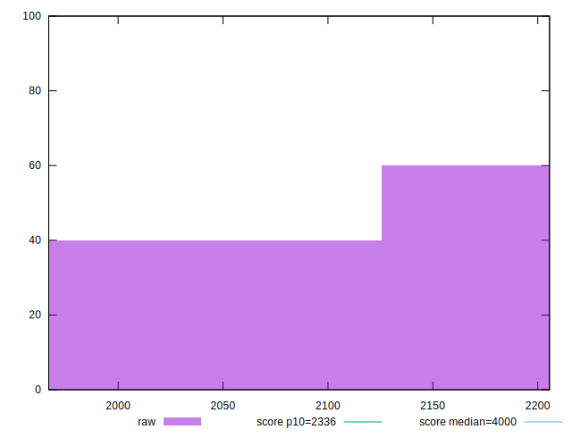

# //first-meaningful-paint/samples/pages+cached+nointeractive

[→ Parent](../..)


## Raw


```yaml
p90min: 1966.9283
p90max: 2203.7442
p90range: 236.81590000000006
p90mean: 2096.028120555556
p90median: 2127.27495
p90stdev: 106.08893336952517
p90skewness: -0.21165883631809054
p90eccentricity: 1
p90discretization: 1
outlandishness: 1.01040285449162

```


## Score


```yaml
p90min: 0.9219679058503829
p90max: 0.9540168351841156
p90range: 0.03204892933373271
p90mean: 0.9336413362277423
p90median: 0.9229029358413234
p90stdev: 0.01380413197312914
p90skewness: 0.6509688159566497
p90eccentricity: 1
p90discretization: 1
outlandishness: 1.0044051457318326

```

