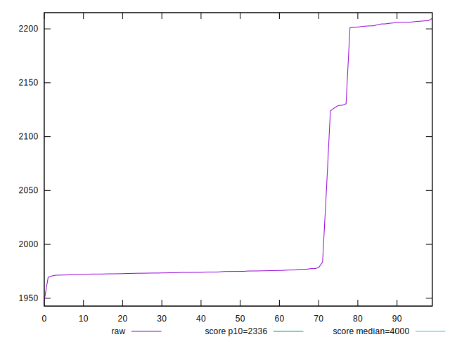
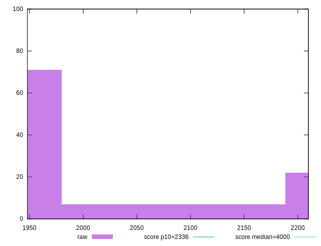

# //first-meaningful-paint/samples/pages+cached

[→ Parent](../..)


## Raw


```yaml
p90min: 1947.971
p90max: 2205.4764999999998
p90range: 257.50549999999976
p90mean: 2013.7797500000001
p90median: 1974.4517500000002
p90stdev: 82.52802051796274
p90skewness: 1.6656553416548998
p90eccentricity: 0.9999999999999999
p90discretization: 1
outlandishness: 1.019276257774637

```


## Score


```yaml
p90min: 0.9212994102952925
p90max: 0.9540096097283219
p90range: 0.03271019943302944
p90mean: 0.9447708636342262
p90median: 0.9536273845699172
p90stdev: 0.01371024788780798
p90skewness: -0.9465243858690022
p90eccentricity: 0.999999999999999
p90discretization: 1
outlandishness: 1.0020316092694408

```

