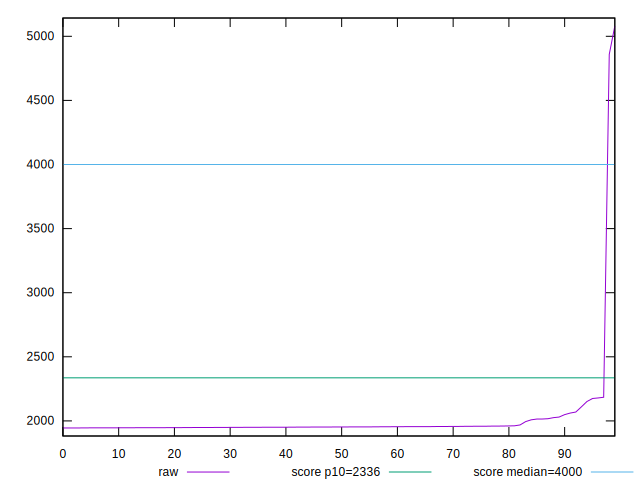

# //first-meaningful-paint/samples/pages

[→ Parent](../..)


## Raw


```yaml
p90min: 1945.1889999999999
p90max: 2109.54
p90range: 164.3510000000001
p90mean: 1962.1564120879111
p90median: 1952.4404999999997
p90stdev: 29.8103641849345
p90skewness: 2.939336217916076
p90eccentricity: 0.9999999999999996
p90discretization: 1
outlandishness: 1.070562864329683

```


## Score


```yaml
p90min: 0.9252430657944424
p90max: 0.956986709444672
p90range: 0.031743643650229636
p90mean: 0.9537637735133327
p90median: 0.9561759780855161
p90stdev: 0.006789374322691311
p90skewness: -3.0170169224119663
p90eccentricity: 1.0000000000000007
p90discretization: 1
outlandishness: 0.9733713468805825

```


## P Score


```yaml
p90min: 0.9252430657944424
p90max: 0.956986709444672
p90range: 0.031743643650229636
p90mean: 0.9537637735133327
p90median: 0.9561759780855161
p90stdev: 0.006789374322691311
p90skewness: -3.0170169224119663
p90eccentricity: 1.0000000000000007
p90discretization: 1
outlandishness: 0.9733713468805825

```


## Score Difference


```yaml
p90min: 0.001095134622069005
p90max: 0.004803668751931056
p90range: 0.003708534129862051
p90mean: 0.003549681966522821
p90median: 0.0035485433673092537
p90stdev: 0.0006669999328279789
p90skewness: -1.0714080500685763
p90eccentricity: 1
p90discretization: 1
outlandishness: 0.7241298426365426

```


## P Score Difference


```yaml
p90min: 0
p90max: 0
p90range: 0
p90mean: 0
p90median: 0
p90stdev: 0
p90skewness: .nan
p90eccentricity: .nan
p90discretization: 91
outlandishness: .nan

```

