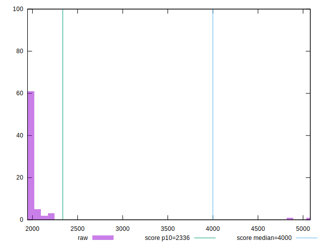
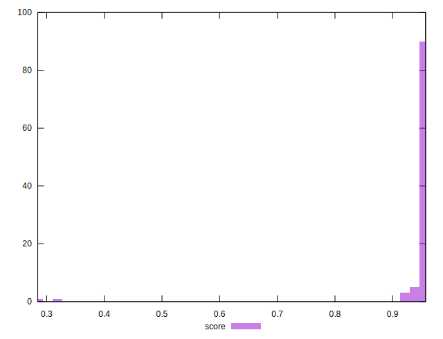

# //first-meaningful-paint/samples/pages

[→ Parent](../..)


## Raw


```yaml
p90min: 1945.0035000000003
p90max: 2030.041
p90range: 85.03749999999968
p90mean: 1956.692827777778
p90median: 1952.00975
p90stdev: 17.7913795566469
p90skewness: 2.9450496241556343
p90eccentricity: 0.999999999999999
p90discretization: 1
outlandishness: 1.076549779074665

```


## Score


```yaml
p90min: 0.28451012032679907
p90max: 0.9569579435856786
p90range: 0.6724478232588795
p90mean: 0.9391954259985513
p90median: 0.956164601828506
p90stdev: 0.09619001266093946
p90skewness: -6.441080885961177
p90eccentricity: 1
p90discretization: 1
outlandishness: 1.0038024829588772

```

