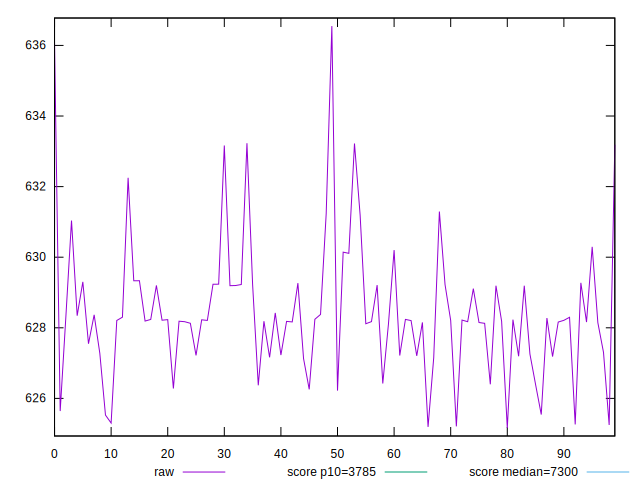
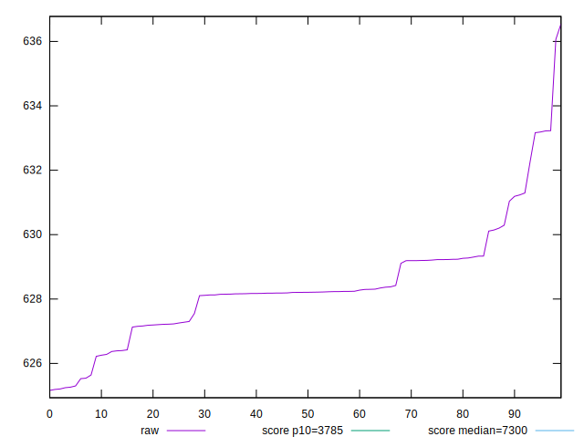
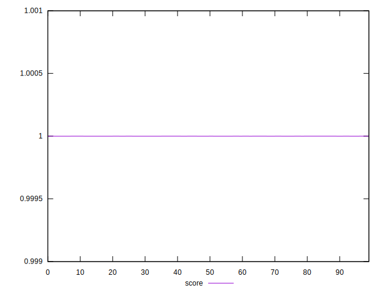

# //interactive/samples/empty

[→ Parent](../..)


## Raw


```yaml
p90min: 625.20675
p90max: 631.29395
p90range: 6.087199999999939
p90mean: 628.121121978022
p90median: 628.20435
p90stdev: 1.3320611023920694
p90skewness: -0.08782431916081142
p90eccentricity: 1
p90discretization: 1
outlandishness: 1.0011125661661102

```


## Score


```yaml
p90min: 0.9999991050872981
p90max: 0.9999991854636331
p90range: 8.037633503210628e-8
p90mean: 0.9999991476361031
p90median: 0.9999991466937688
p90stdev: 1.7545055557152025e-8
p90skewness: 0.027799944341029916
p90eccentricity: 1.0000000000000002
p90discretization: 1
outlandishness: 0.9999999903350332

```

