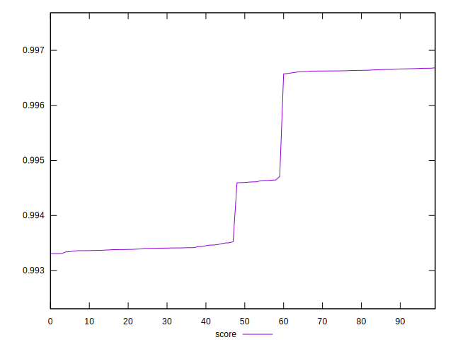

# //interactive/samples/pages+cached+noadtech

[→ Parent](../..)


## Raw


```yaml
p90min: 1817.7876000000003
p90max: 2055.00835
p90range: 237.22074999999973
p90mean: 1961.9513296703299
p90median: 2043.9419500000004
p90stdev: 104.29561249191438
p90skewness: -0.5266544508091479
p90eccentricity: 1.0000000000000002
p90discretization: 1
outlandishness: 0.986737393108723

```


## Score


```yaml
p90min: 0.9933050876219027
p90max: 0.9966616002704618
p90range: 0.0033565126485590735
p90mean: 0.9946596824604159
p90median: 0.9934999104686717
p90stdev: 0.0014704645148124961
p90skewness: 0.48156625890148375
p90eccentricity: 1.0000000000000007
p90discretization: 1
outlandishness: 1.0003640276158747

```


## P Score


```yaml
p90min: 0.9933050876219027
p90max: 0.9966616002704618
p90range: 0.0033565126485590735
p90mean: 0.9946596824604159
p90median: 0.9934999104686717
p90stdev: 0.0014704645148124961
p90skewness: 0.48156625890148375
p90eccentricity: 1.0000000000000007
p90discretization: 1
outlandishness: 1.0003640276158747

```


## Score Difference


```yaml
p90min: -0.004708509994889476
p90max: 0.0033762899088061182
p90range: 0.008084799903695594
p90mean: -0.0012598861756004018
p90median: -0.003370878171599312
p90stdev: 0.003339347359492436
p90skewness: 0.6239567883381041
p90eccentricity: 0.9999999999999997
p90discretization: 1
outlandishness: 0.4452741831977032

```


## P Score Difference


```yaml
p90min: 0
p90max: 0
p90range: 0
p90mean: 0
p90median: 0
p90stdev: 0
p90skewness: .nan
p90eccentricity: .nan
p90discretization: 91
outlandishness: .nan

```

