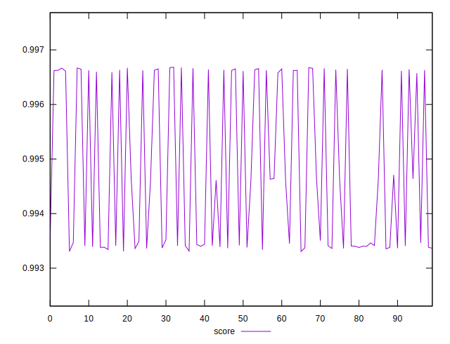

# //interactive/samples/pages+cached+noadtech

[→ Parent](../..)


## Raw


```yaml
p90min: 1815.857
p90max: 2051.8097500000003
p90range: 235.95275000000038
p90mean: 1937.2918400000012
p90median: 1974.4894
p90stdev: 107.5439816472462
p90skewness: -0.09931674613438188
p90eccentricity: 1.0000000000000002
p90discretization: 1
outlandishness: 1.0120173246012685

```


## Score


```yaml
p90min: 0.9933050876219027
p90max: 0.996657715117523
p90range: 0.003352627495620264
p90mean: 0.9946374389291928
p90median: 0.9934941782791326
p90stdev: 0.0014633067244690743
p90skewness: 0.5112528924840233
p90eccentricity: 0.9999999999999996
p90discretization: 1
outlandishness: 1.0004087713112628

```

