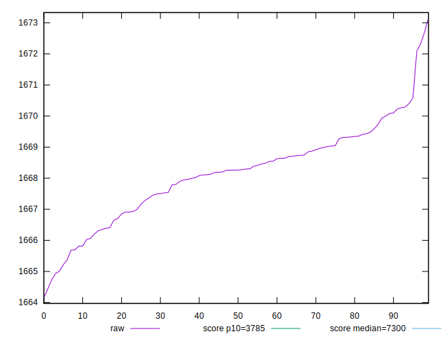
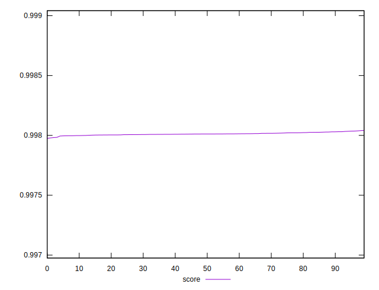

# //interactive/samples/pages+cached+noexternal+nocss

[→ Parent](../..)


## Raw


```yaml
p90min: 1665.2136999999998
p90max: 1670.5841999999998
p90range: 5.370499999999993
p90mean: 1668.1580043956042
p90median: 1668.2639
p90stdev: 1.267550657106961
p90skewness: -0.34557371829790234
p90eccentricity: 1
p90discretization: 1
outlandishness: 1.0000012284264546

```


## Score


```yaml
p90min: 0.9979945876141362
p90max: 0.9980341569575328
p90range: 0.000039569343396661516
p90mean: 0.9980125201040624
p90median: 0.998011755603347
p90stdev: 0.000009340227096387799
p90skewness: 0.33820592682015654
p90eccentricity: 1.0000000000000002
p90discretization: 1
outlandishness: 0.999999959059316

```

