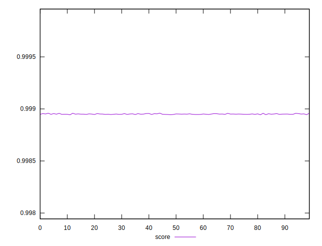
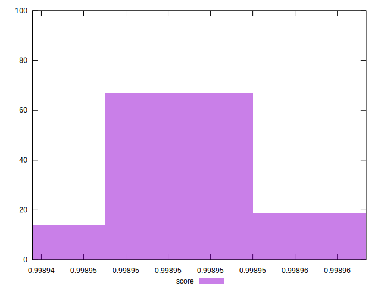

# //interactive/samples/pages+cached+noexternal+nofonts+nosvg+noimg+nocss+nojs

[→ Parent](../..)


## Raw


```yaml
p90min: 1506.9898
p90max: 1509.8064
p90range: 2.8165999999998803
p90mean: 1508.8097111111108
p90median: 1508.9313000000002
p90stdev: 0.7209482398502817
p90skewness: -0.7865169017680431
p90eccentricity: 1.0000000000000002
p90discretization: 1.0112359550561798
outlandishness: 1.0001692331233056

```


## Score


```yaml
p90min: 0.9989435797760928
p90max: 0.9989552817738065
p90range: 0.000011701997713720047
p90mean: 0.9989497205295476
p90median: 0.9989496691059767
p90stdev: 0.0000027855350524255654
p90skewness: 0.16585318668106933
p90eccentricity: 1.0000000000000002
p90discretization: 1.0112359550561798
outlandishness: 1.0000015949514958

```

