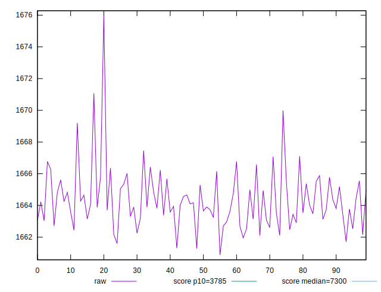
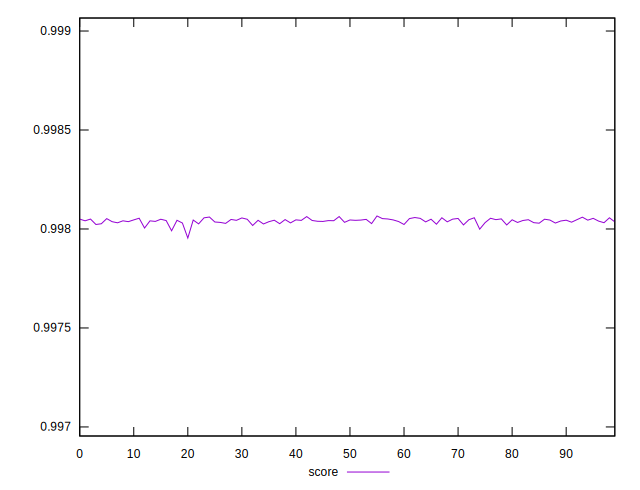
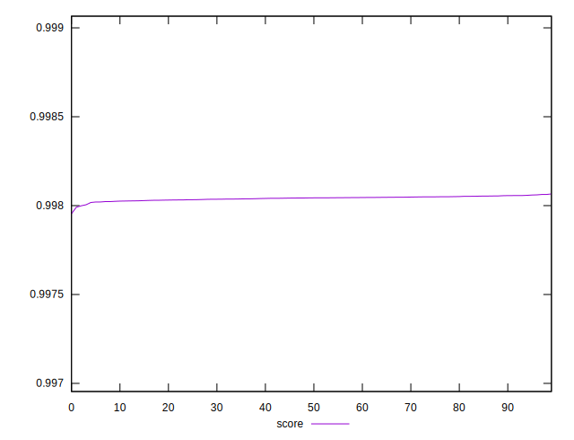

# //interactive/samples/pages+cached+noexternal+nofonts+nosvg+noimg+nocss

[→ Parent](../..)


## Raw


```yaml
p90min: 1660.8732000000005
p90max: 1666.4223
p90range: 5.549099999999498
p90mean: 1663.89601
p90median: 1663.81435
p90stdev: 1.2948633277557364
p90skewness: 0.0032481793722274927
p90eccentricity: 1.0000000000000002
p90discretization: 1
outlandishness: 1.000589859392038

```


## Score


```yaml
p90min: 0.9979542582314304
p90max: 0.998055751398229
p90range: 0.00010149316679863851
p90mean: 0.9980380004543213
p90median: 0.9980420247513602
p90stdev: 0.000014837572499525267
p90skewness: -2.6126653634307258
p90eccentricity: 0.9999999999999993
p90discretization: 1
outlandishness: 1.0000043131893381

```

