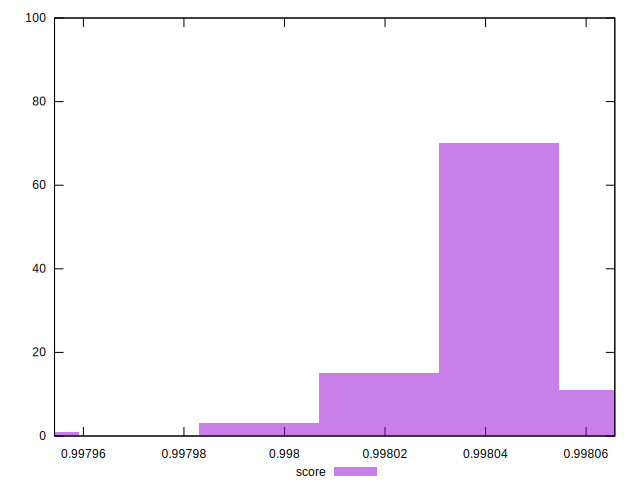

# //interactive/samples/pages+cached+noexternal+nofonts+nosvg+noimg+nocss

[→ Parent](../..)


## Raw


```yaml
p90min: 1661.7190999999998
p90max: 1667.1036
p90range: 5.384500000000116
p90mean: 1664.174618681319
p90median: 1663.9063999999998
p90stdev: 1.326305871183827
p90skewness: 0.3396354803807384
p90eccentricity: 1.0000000000000009
p90discretization: 1
outlandishness: 1.0002548588666476

```


## Score


```yaml
p90min: 0.9980202994450238
p90max: 0.9980595898042457
p90range: 0.00003929035922189961
p90mean: 0.9980417271483428
p90median: 0.9980437001375949
p90stdev: 0.000009677655225877658
p90skewness: -0.3461370722680898
p90eccentricity: 1.0000000000000007
p90discretization: 1
outlandishness: 0.9999968451586208

```


## P Score


```yaml
p90min: 0.9980202994450238
p90max: 0.9980595898042457
p90range: 0.00003929035922189961
p90mean: 0.9980417271483428
p90median: 0.9980437001375949
p90stdev: 0.000009677655225877658
p90skewness: -0.3461370722680898
p90eccentricity: 1.0000000000000007
p90discretization: 1
outlandishness: 0.9999968451586208

```


## Score Difference


```yaml
p90min: 0.0019404101957543052
p90max: 0.001979700554976205
p90range: 0.00003929035922189961
p90mean: 0.0019582728516572357
p90median: 0.0019562998624050865
p90stdev: 0.000009677655225877662
p90skewness: 0.34613707221404566
p90eccentricity: 0.9999999999999993
p90discretization: 1
outlandishness: 1.0016085253327471

```


## P Score Difference


```yaml
p90min: 0
p90max: 0
p90range: 0
p90mean: 0
p90median: 0
p90stdev: 0
p90skewness: .nan
p90eccentricity: .nan
p90discretization: 91
outlandishness: .nan

```

