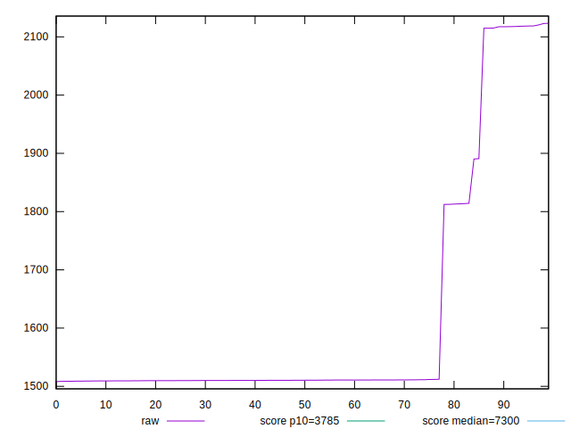

# //interactive/samples/pages+cached+noexternal+nofonts+nosvg+noimg

[→ Parent](../..)


## Raw


```yaml
p90min: 1508.0034
p90max: 2117.3809500000007
p90range: 609.3775500000006
p90mean: 1571.7963252747245
p90median: 1510.3378
p90stdev: 159.99083897558123
p90skewness: 2.512672186359603
p90eccentricity: 1
p90discretization: 1
outlandishness: 1.0637104652967722

```


## Score


```yaml
p90min: 0.9921300467379983
p90max: 0.9989547655932997
p90range: 0.006824718855301337
p90mean: 0.9983557479901821
p90median: 0.9989441340064582
p90stdev: 0.0016518612681491254
p90skewness: -3.0078224528866726
p90eccentricity: 1
p90discretization: 1
outlandishness: 0.9988700711702163

```


## P Score


```yaml
p90min: 0.9921300467379983
p90max: 0.9989547655932997
p90range: 0.006824718855301337
p90mean: 0.9983557479901821
p90median: 0.9989441340064582
p90stdev: 0.0016518612681491254
p90skewness: -3.0078224528866726
p90eccentricity: 1
p90discretization: 1
outlandishness: 0.9988700711702163

```


## Score Difference


```yaml
p90min: -0.002116054915311416
p90max: 0.0033001171958955133
p90range: 0.005416172111206929
p90mean: 0.0009615478461626775
p90median: 0.0010550565400202494
p90stdev: 0.001036494382283394
p90skewness: -1.1900846594614307
p90eccentricity: 1
p90discretization: 1
outlandishness: 0.7069052422559439

```


## P Score Difference


```yaml
p90min: 0
p90max: 0
p90range: 0
p90mean: 0
p90median: 0
p90stdev: 0
p90skewness: .nan
p90eccentricity: .nan
p90discretization: 91
outlandishness: .nan

```

