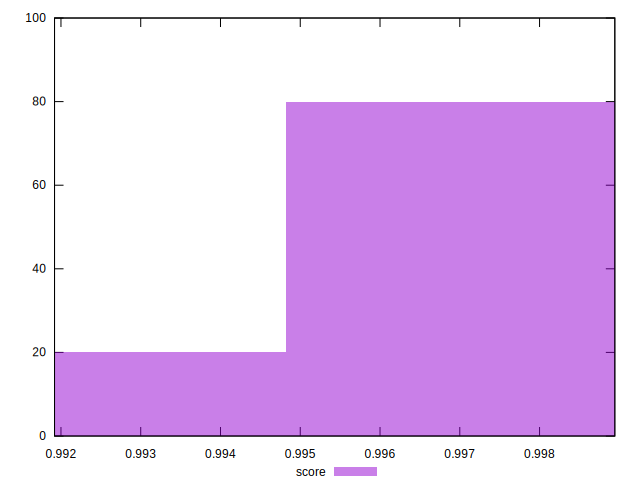

# //interactive/samples/pages+cached+noexternal+nofonts

[→ Parent](../..)


## Raw


```yaml
p90min: 1510.4286000000002
p90max: 2121.58605
p90range: 611.1574499999997
p90mean: 1636.5479159340653
p90median: 1512.6099999999997
p90stdev: 214.9186381226493
p90skewness: 1.3820440854927267
p90eccentricity: 0.9999999999999999
p90discretization: 1
outlandishness: 1.0545006188147241

```


## Score


```yaml
p90min: 0.9920460177250782
p90max: 0.9989437188118528
p90range: 0.006897701086774677
p90mean: 0.9977115004601961
p90median: 0.9989337065254715
p90stdev: 0.002284928720133752
p90skewness: -1.733910794765396
p90eccentricity: 0.9999999999999999
p90discretization: 1
outlandishness: 0.9989639575257606

```

