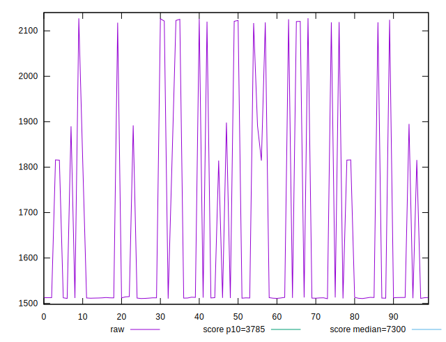
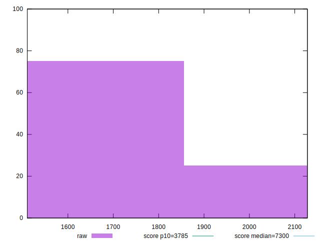

# //interactive/samples/pages+cached+noexternal+nofonts

[→ Parent](../..)


## Raw


```yaml
p90min: 1510.4286000000002
p90max: 2121.0107
p90range: 610.5820999999996
p90mean: 1631.1586033333335
p90median: 1512.5775499999997
p90stdev: 209.90516108500736
p90skewness: 1.439887973549556
p90eccentricity: 0.9999999999999999
p90discretization: 1
outlandishness: 1.0614802243177217

```


## Score


```yaml
p90min: 0.9919193843592118
p90max: 0.9989388391849601
p90range: 0.007019454825748284
p90mean: 0.9970004390059677
p90median: 0.9989315802052794
p90stdev: 0.0028115544999336353
p90skewness: -1.028291174496148
p90eccentricity: 1.0000000000000004
p90discretization: 1
outlandishness: 1.000389389328265

```

