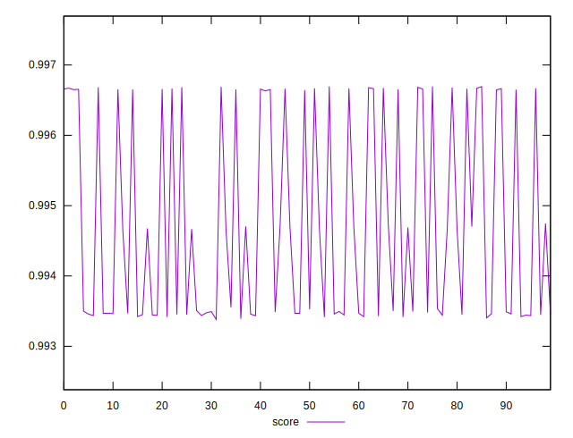

# //interactive/samples/pages+cached+noexternal+noimg

[→ Parent](../..)


## Raw


```yaml
p90min: 1814.6572999999999
p90max: 2047.6799499999997
p90range: 233.02264999999989
p90mean: 1944.4616266666653
p90median: 1972.3889
p90stdev: 104.63605322611224
p90skewness: -0.2905399156115366
p90eccentricity: 1
p90discretization: 1
outlandishness: 1.0107758261921214

```


## Score


```yaml
p90min: 0.9933819951670377
p90max: 0.9966707031736972
p90range: 0.00328870800665948
p90mean: 0.9945514732080775
p90median: 0.9935010558835298
p90stdev: 0.0013784637562371327
p90skewness: 0.7124671033010698
p90eccentricity: 0.9999999999999997
p90discretization: 1
outlandishness: 1.000429170383696

```

