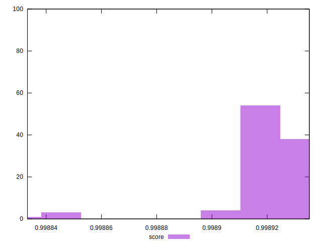

# //interactive/samples/pages+cached+noexternal+nojs

[→ Parent](../..)


## Raw


```yaml
p90min: 1512.924
p90max: 1518.6891
p90range: 5.765100000000075
p90mean: 1515.0207197802201
p90median: 1514.7986
p90stdev: 1.2591436802529017
p90skewness: 0.5036632834448176
p90eccentricity: 0.9999999999999996
p90discretization: 1
outlandishness: 1.0009284485439753

```


## Score


```yaml
p90min: 0.9989054216431159
p90max: 0.9989322593663874
p90range: 0.000026837723271500025
p90mean: 0.9989225454180434
p90median: 0.998923588493513
p90stdev: 0.000005852532505920724
p90skewness: -0.5129263912436918
p90eccentricity: 0.9999999999999999
p90discretization: 1
outlandishness: 0.999993269853919

```

